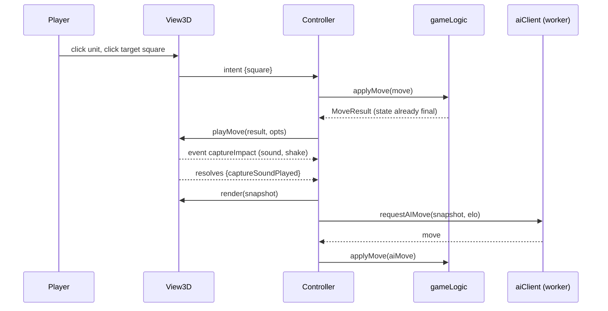
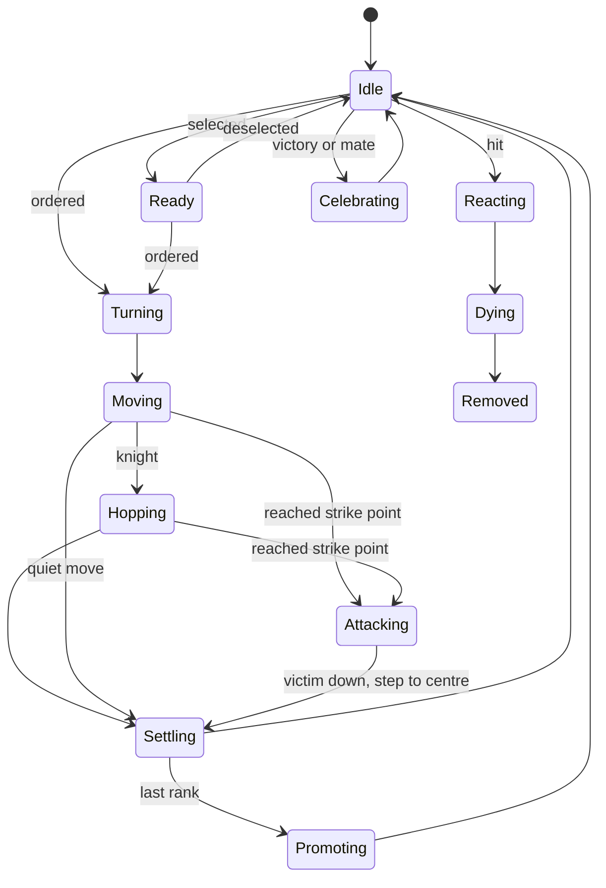
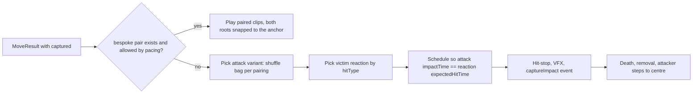

# 3D battle mode: architecture

Back to [README](README.md) · [plan](plan.md). Grounded in the code at commit `3276e18`. Research basis: [research/engine-camera.md](research/engine-camera.md) (cited as Engine), [research/characters-animation.md](research/characters-animation.md) (Characters) and [research/design-choreography-production.md](research/design-choreography-production.md) (Design). Code below is a sketch of interfaces and data shapes, not a finished implementation. Items marked **(judgment)** are design choices, not sourced facts.

## Contents

1. [What exists today](#1-what-exists-today)
2. [The applyMove refactor](#2-the-applymove-refactor)
3. [View interface](#3-view-interface)
4. [Controller flow and event model](#4-controller-flow-and-event-model)
5. [Camera](#5-camera)
6. [Three.js scene, loading and picking](#6-threejs-scene-loading-and-picking)
7. [Unit state machine](#7-unit-state-machine)
8. [Movement rules](#8-movement-rules)
9. [Duel anchor and impact-synced clips](#9-duel-anchor-and-impact-synced-clips)
10. [Asset loading and compression budget](#10-asset-loading-and-compression-budget)
11. [Performance budget, feature detection and fallback](#11-performance-budget-feature-detection-and-fallback)
12. [Testing strategy](#12-testing-strategy)
13. [File and module layout](#13-file-and-module-layout)

## 1. What exists today

| File | Role today | Change in this plan |
|---|---|---|
| `gameLogic.js` | Rules on mutable globals (`board`, `currentPlayer`, `castlingRights`, `enPassantTarget`, clocks, `gameHistory`), move generation, end detection, `pushHistoryState`, notation | Gains `applyMove()` and the end-of-move evaluation |
| `aiPlayer.js`, `aiWorker.js`, `aiClient.js` | Search in a Web Worker; `requestAIMove(state, elo)` returns `{ promise, cancel }` from a state snapshot | **Unchanged.** Already view independent |
| `ui.js` | DOM rendering, input, **and part of the state transition**: `makeMove()` mutates the board via `setPieceAt`, plays the capture scene, then `finishMoveProcessing()` updates castling rights, en passant, clocks, switches the player, pushes history and calls `evaluateGameState()` | Split into controller, `View2D`, and panel/settings code |
| `battleFx.js` | 2D GSAP capture scenes on glyph clones in `.battle-layer`; Full/Fast/Off; every scene resolves on completion, skip, cancel, timeout or hidden tab | Unchanged; used by `View2D`. Its contract is copied by the 3D fights |
| `index.html` | Classic scripts in order: `gameLogic.js`, `aiPlayer.js`, `aiClient.js`, `battleFx.js`, `ui.js`; GSAP from cdnjs | Adds an import map and `controller.js`, `view2d.js` |

Two existing patterns carry over unchanged: `positionVersion` (bumped on every position change so stale async work drops out) and "a scene always ends" (`battleFx.js` header).

## 2. The applyMove refactor

Today the state transition is split across the animation: the board is mutated before the capture scene, and castling rights, en passant, clocks, the turn switch and history are updated in `finishMoveProcessing()` after it. A 3D view would have to reproduce that timing. Instead, apply the whole move at once in the rules layer and let views animate from a description of it (Engine §5.2).

```js
// gameLogic.js (classic script, global function)

/**
 * @typedef {{row:number, col:number}} Square
 * @typedef {Object} MoveResult
 * @property {Square} from
 * @property {Square} to
 * @property {string} piece             'N', 'p', ... as it stood on `from`
 * @property {string} placedPiece       differs from `piece` on promotion
 * @property {{piece:string, row:number, col:number}|null} captured
 *           victim and where it stood (en passant: row is from.row, not to.row)
 * @property {{from:Square, to:Square}|null} rook   castling rook path
 * @property {boolean} isCastling
 * @property {boolean} isEnPassant
 * @property {'Q'|'R'|'B'|'N'|null} promotion
 * @property {string} notation          with '+' or '#', as shown in the move list
 * @property {boolean} givesCheck
 * @property {boolean} isMate
 * @property {boolean} isGameOver
 * @property {string} statusMessage
 * @property {string} mover             'w' | 'b'
 */

/**
 * Pure position transition: board, castling rights (including a rook captured on its home
 * square), en passant target, halfmove and fullmove clocks, side to move. No validation, no
 * history, no notation, no end-of-game evaluation. Mutates and returns `state`
 * ({ board, currentPlayer, castlingRights, enPassantTarget, halfmoveClock, fullmoveNumber }).
 * The perft harness in tests/unit/gameLogic.test.js (perftMake) calls this, so perft covers
 * the same code the game uses.
 */
function applyMoveCore(state, move) { /* body moved from ui.js makeMove + finishMoveProcessing steps 1 to 4 */ }

/**
 * Validates the move, runs applyMoveCore on the live globals, builds notation, pushes history,
 * evaluates check, mate and draws, and describes what happened. Returns null for an illegal
 * move. Never touches the DOM.
 * @param {{from:Square, to:Square, promotion?:'Q'|'R'|'B'|'N'}} move
 * @returns {MoveResult|null}
 */
function applyMove(move) { /* validation + applyMoveCore(globals) + pushHistoryState + evaluateGameState */ }

/** Plain-data copy of what a view needs to draw a position. */
function getPositionSnapshot() {
    return { board: board.map(r => r.slice()), currentPlayer, lastMove, inCheck: isKingInCheck(currentPlayer) };
}
```

Notes:
- `evaluateGameState()` (now in `ui.js`) moves into `gameLogic.js`; it only sets `isGameOver` and `gameStatusMessage` and has no DOM dependency. `sideName()` moves with it.
- `previewCheckAfterMove()` is no longer needed: after `applyMove` the result already knows `givesCheck` and `isMate`, so the capture scene can include the check beat as it does today.
- The promotion dialog stays in the UI: if `generateLegalMoves` says the move is a promotion and no choice is given, the controller asks the view or dialog first, then calls `applyMove` with the choice. Cancel still changes nothing.
- The turn switch and the history push now happen before the animation. Input and the AI stay blocked by the controller's busy flag until `playMove` resolves, which preserves today's behaviour. The flag keeps the global name `isAnimating`, because `ui.js` and the integration tests read it (`D.g('isAnimating')`).
- Visible consequence for tests: during the animation `currentMoveIndex` already points at the new entry. The integration test "a move locks input until its animation finishes" asserts 0 there today and must be changed to 1 deliberately (plan.md phase 0). The move list and status line still update only on `moveFinished`, so players see no difference.
- There are three move-application paths today: `makeMove`/`finishMoveProcessing` in `ui.js`, the engine's internal `makeMove` in `aiPlayer.js` (fast search representation, stays as is), and `ChessAI.applyMoveToGlobals()` (`aiPlayer.js` line 978, used by tests and self-play), which writes engine state back into the globals. After the refactor the first becomes `applyMove`; the third is either routed through `applyMove` or covered by an equivalence test against it.
- New classic scripts must be added both to `index.html` and to the script list in `tests/helpers/loadDom.js`, which loads `gameLogic.js`, `aiPlayer.js`, `aiClient.js`, `battleFx.js` and `ui.js` by name.

## 3. View interface

Both the current DOM board and the 3D scene implement one interface. The controller only talks to this interface (Engine §5.2).

```js
/**
 * @interface View
 * mount(container, { onIntent })      create DOM/canvas; onIntent(intent) reports player input
 * render(position, decorations)       draw a position immediately, no animation; also the "snap" after cancel
 * playMove(result, opts) -> Promise<{captureSoundPlayed:boolean}>
 *                                     animate one move; ALWAYS resolves (completion, skip, cancel, timeout, hidden tab)
 * playFinale(result) -> Promise<void> checkmate or draw finale; fire and forget
 * skip()                              jump the current animation to its end state
 * cancelAll()                         stop everything and resolve pending promises
 * setOrientation(color)               'w' | 'b'
 * dispose()                           free GPU and DOM resources
 *
 * decorations = { lastMove, checkSquare, selection, legalTargets: [{row, col, kind}], hint }
 *   kind: 'move' | 'capture' | 'castle' | 'enPassant' | 'promotion'
 * opts = { before: PositionSnapshot, pacing: 'full'|'fast'|'off', firstTimePairing: boolean }
 *   pacing comes from the shared chess.battleMode setting; in 3D 'off' plays the Instant beat (plan.md conflict 20)
 *
 * Intents sent to onIntent:
 *   { type: 'square', row, col }   click or tap or Enter on a square or a unit standing on it
 *   { type: 'deselect' }           Escape or click on empty space
 *   { type: 'skip' }
 *   { type: 'moveText', san }      typed move (accessibility)
 */
```

Rules **(judgment)**:
1. Views never read live game globals. They get a snapshot plus the `MoveResult`; this also means `view3d/` modules need no bridge to the classic-script globals (Engine §1.3 notes a module could read them, but not depending on that is simpler to test).
2. Legal targets are computed by the controller with `generateLegalMoves()` and passed in `decorations`, so both views show identical options.
3. `cancelAll()` followed by `render()` must always leave the view showing exactly the given position.
4. Switching views at runtime: `old.cancelAll(); old.dispose(); next.mount(container, ...); next.render(getPositionSnapshot(), decorations)`.

`View2D` is today's `renderBoard()`, `animatePieceTo()`, `playCaptureAnimation()` and `BattleFX` calls, moved behind this interface. `View3D` is the new module.

## 4. Controller flow and event model

```js
// controller.js (classic script) (sketch)
async function commitMove(move) {
    if (isAnimating) return false;               // the busy flag keeps today's global name
    const before = getPositionSnapshot();
    const result = applyMove(move);              // game state is final from here on
    if (!result) return false;
    isAnimating = true;
    const version = ++positionVersion;
    bus.emit('moveStarted', result);
    const outcome = await withTimeout(
        view.playMove(result, { before, pacing: pacingFor(result), firstTimePairing: isFirstTime(result) }),
        maxSceneMs(result) + 500);               // belt and braces: the view must resolve anyway
    if (version !== positionVersion) return true; // new game or abort: abortInFlightWork() already cleared isAnimating
    isAnimating = false;
    bus.emit('moveFinished', { result, outcome }); // move list, status line and sounds update here, not after applyMove
    view.render(getPositionSnapshot(), decorationsFor(null));
    if (result.isGameOver) view.playFinale(result);
    maybeStartAI();                              // unchanged requestAIMove(getCurrentGameStateSnapshot(), elo)
    return true;
}
```

Events (a small `EventTarget` wrapper). Sounds, the move list, the status line and `aria-live` announcements subscribe, so they work with either view (Engine §5.2).

| Event | Payload | Emitted by | Typical subscribers |
|---|---|---|---|
| `positionChanged` | snapshot | controller | status line, move list, minimap |
| `selectionChanged` | square or null | controller | views, minimap |
| `moveStarted` | `MoveResult` | controller | `aria-live`, move sound for quiet moves |
| `captureStarted` | `MoveResult` | view | camera (battle framing), music duck |
| `captureImpact` | `{ result, hitType }` | view, at the contact frame | capture sound, screen shake, haptics |
| `captureFinished` | `MoveResult` | view | camera return |
| `moveFinished` | `{ result, outcome }` | controller | check sound, game-over sound |
| `checkGiven` | `MoveResult` | controller | king "alarm" idle, check sound |
| `gameOver` | `MoveResult` | controller | finale, game-over sound |
| `reviewEntered` / `reviewExited` | index | controller | views (no fights in review) |



## 5. Camera

`camera-controls` 3.1.2 (MIT), installed with `CameraControls.install({ THREE })` (Engine §2.1). Chosen over three's `MapControls` because snaps and the battle camera need smooth programmatic transitions.

```js
// view3d/camera.js (sketch; check option and action names against the camera-controls 3.1.2 README
import * as THREE from 'three';
import CameraControls from 'camera-controls';
CameraControls.install({ THREE });

export function createRig(camera, dom, boardSize) {
    const c = new CameraControls(camera, dom);
    c.minPolarAngle = THREE.MathUtils.degToRad(25);   // polar is measured from vertical
    c.maxPolarAngle = THREE.MathUtils.degToRad(70);   // never edge-on or from below (Engine §2.2)
    c.minDistance = 0.8 * boardSize;
    c.maxDistance = 2.5 * boardSize;
    const m = boardSize / 2 + 0.5;
    c.setBoundary(new THREE.Box3(new THREE.Vector3(-m, 0, -m), new THREE.Vector3(m, 0, m)));
    c.mouseButtons.left = CameraControls.ACTION.NONE;     // left click gives orders
    c.mouseButtons.right = CameraControls.ACTION.ROTATE;
    c.mouseButtons.middle = CameraControls.ACTION.TRUCK;
    c.mouseButtons.wheel = CameraControls.ACTION.DOLLY;
    c.touches.one = CameraControls.ACTION.TOUCH_ROTATE;   // decision in plan.md conflict 10
    c.touches.two = CameraControls.ACTION.TOUCH_DOLLY_TRUCK;
    return {
        controls: c,
        snapToSide: (color) => c.setLookAt(/* behind that side's back rank */ ..., true), // returns a Promise
        rotateStep: (dir) => c.rotate(dir * Math.PI / 2, 0, true),                       // Q / E
        topDown: () => { c.minPolarAngle = 0; return c.rotatePolarTo(0, true); },        // T
        // every other snap, Q/E and the first user drag restore minPolarAngle to 25 degrees
        save: () => c.toJSON(), restore: (s) => c.fromJSON(s, true),                     // battle camera return
    };
}
```

Input map (plan.md conflict 10): left click orders; right drag rotates; middle drag or Shift+left drag pans; wheel zooms; WASD and arrows pan (`truck`); Q/E rotate 90 degrees; `1` White view, `2` Black view, `T` top-down, Home reset. Edge scrolling is off by default. Touch: tap selects (movement threshold about 8 px separates tap from drag), one-finger drag rotates, pinch zooms, two-finger drag pans (Engine §2.2).

Battle camera (Full pacing only, Design §3.9): save the player camera, blend about 0.4 s to a two-shot on the player's side of the attacker to victim line, at most one cut, then restore the saved state exactly. Disabled in Fast, Off, reduced motion and always in AI vs AI (plan.md conflict 20).

## 6. Three.js scene, loading and picking

### Loading without a build step

```html
<!-- index.html, before any module code; classic scripts keep their order -->
<script type="importmap">
{
  "imports": {
    "three": "https://cdn.jsdelivr.net/npm/three@0.186.1/build/three.module.min.js",
    "three/addons/": "https://cdn.jsdelivr.net/npm/three@0.186.1/examples/jsm/",
    "camera-controls": "https://cdn.jsdelivr.net/npm/camera-controls@3.1.2/dist/camera-controls.module.js"
  }
}
</script>
```

```js
// controller.js or ui.js (classic script): load 3D only when the player turns it on (Engine §4.4)
async function loadView3D() {
    const { createView3D } = await import('./view3d/main.js'); // dynamic import works from classic scripts
    return createView3D({ onProgress: showLoadProgress });
}
```

Versions are pinned in the URLs (Engine §1.3). The same bare specifiers (`three`, `camera-controls`) resolve to `node_modules` in Node tests if both packages are added as dev dependencies at the same versions, so the scene code runs unchanged in tests.

### Scene graph

```
Scene
├─ Lights: hemisphere or environment map, one directional light with shadow (board-sized frustum)
├─ Environment: table, toy-box lid
├─ Board: 64 squares (or one mesh), markers layer (legal dots, capture rings, path lines)
├─ PickProxies: 64 invisible flat boxes, userData {row, col}
├─ Units
│   └─ Unit (Group at square centre, root driven by code)
│       ├─ BaseDisc: army accent colour, selection / threat / check rings
│       ├─ Model: SkinnedMesh cloned with SkeletonUtils.clone (shared geometry and materials)
│       └─ PickCapsule: invisible
├─ DuelAnchor: Group placed per capture (section 9)
└─ FX: pooled sprites and particles
```

Units keep stable identities so animations target the right object. `render(position)` reconciles: units already on the right square stay, others are matched by piece code and teleported, missing ones are created from the pool, extra ones are hidden. `playMove` updates the square to unit map from the `MoveResult`.

### Picking

`THREE.Raycaster` against the square proxies and unit capsules only, never against skinned meshes (current three.js raycasts skinned meshes with bone transforms, which is correct but slow on the CPU; Engine §2.3 describes an older bind-pose behaviour). `pointerdown` and `pointerup` positions are compared to tell a click from a camera drag. Hover shows a base highlight; hovering a legal square shows the path preview.

## 7. Unit state machine

Three.js has `AnimationMixer` cross-fades but no state machine (Engine §1.2). Each unit gets a small one (about 100 lines, Engine **judgment**).



Any state can jump to a snapped Idle on `skip()` or `cancelAll()`: stop actions, place the root on the target square, face the side's forward direction.

```js
// view3d/unitFsm.js (sketch)
const CLIP_FOR = { Idle: 'idle', Ready: 'ready', Moving: 'move', Hopping: 'move', Reacting: 'hit',
                   Dying: 'death', Celebrating: 'victory' };          // Attacking picks a variant at runtime
export class UnitFsm {
    constructor(unit, mixer, clipLib) { this.unit = unit; this.mixer = mixer; this.clips = clipLib; this.state = 'Idle'; }
    go(next, { clip, fade = 0.2, timeScale = 1, once = false } = {}) {
        const action = this.mixer.clipAction(this.clips.get(this.unit.role, clip ?? CLIP_FOR[next]));
        action.reset().setEffectiveTimeScale(timeScale);
        if (once) { action.setLoop(THREE.LoopOnce, 1); action.clampWhenFinished = true; }
        if (this.action) this.action.crossFadeTo(action, fade, false);
        action.play();
        this.action = action; this.state = next;
    }
}
```

## 8. Movement rules

Root position is driven by code; locomotion clips are in place (Engine §3.1). Timings come from the pacing setting; there is no separate speed multiplier.

| Case | Rule | Source |
|---|---|---|
| Turn | Rotate around Y by the shortest angle in about 0.2 s while blending Idle to Move | Engine §3.2 |
| Slide (pawn, bishop, rook, queen, king) | Straight line through squares that chess rules guarantee are empty. 1.5 to 2 squares per second; switch to a run clip for long slides; total capped at **1.2 s**. Set `timeScale = speed / clipNativeSpeed` to limit foot sliding | Engine §3.2, §3.3; plan.md conflict 1 |
| Settle | Blend to Idle over 0.2 s, snap to the square centre, face the side's forward direction | Engine §3.2 |
| Knight | Parabolic hop, height `y = 4h·t(1 - t)` with peak `h` about 0.6 square (above unit height so it clears neighbours), 0.6 to 0.8 s | Engine §2.5, §3.3 |
| Castling | King walks two squares first. Rook steps half a square off the back edge of the board, walks behind the king, steps back onto its square; starts 0.2 s before the king finishes. No two capsules may intersect at any sampled frame (tested) | Engine §2.5; plan.md conflict 11 |
| Capture | Attacker travels to the **strike point** (anchor minus contact distance), fights (section 9), then steps to the square centre after the victim is removed | Engine §3.3, Design §3.3 |
| En passant | The anchor is on the victim's square (`captured.row`, which is the attacker's start rank). The attacker strikes from beside it, then steps to `to` | Engine §2.5; `victimRow` logic in today's `makeMove` |
| Promotion | After arrival (and any fight), play the promotion effect; swap the model at the brightest frame | Engine §2.5, Design §3.7 |
| Review and undo | Units slide to their positions with no fights; captured units fade back in | Design §4.6 |

Diagonal moves pass close to occupied neighbours; at a unit footprint of 60 to 70% of a square there is no visible overlap (Engine §3.3, judgment). Occluding units between the camera and the selected unit dither fade (Design §2.2).

## 9. Duel anchor and impact-synced clips

The composition model is the one `battleFx.js` already uses (signature pair, else attack plus impact plus death), with timing aligned on a contact frame (Design §3.2 to 3.3; Characters §3.5).



Clip metadata lives next to the assets, so animators and code agree on the contract:

```json
{
  "pawn.attackA":   { "file": "anims/fight_pawn.glb", "clip": "Attack_A", "impactTime": 0.42, "hitType": "thrust", "reach": "melee" },
  "rook.attackA":   { "file": "anims/fight_rook.glb", "clip": "Attack_A", "impactTime": 0.65, "hitType": "smash",  "reach": "melee" },
  "bishop.attackA": { "file": "anims/fight_bishop.glb", "clip": "Attack_A", "impactTime": 0.55, "hitType": "magic", "reach": "ranged" },
  "queen.death.blunt": { "file": "anims/fight_queen.glb", "clip": "Death_Blunt", "expectedHitTime": 0.08 },
  "pair.rook.rook": { "file": "anims/pair_rook_rook.glb", "clips": ["Rook_A", "Rook_B"], "impactTime": 1.9 }
}
```

```js
// view3d/duel.js (sketch)
const REACH = { melee: 0.7, reach: 1.0, ranged: 1.6 };        // in squares (Design §3.3)
export function stageDuel(result, attacker, clips, rng) {
    const anchor = squareCentre(result.captured.row, result.captured.col);
    const dir = anchor.clone().sub(attacker.root.position).setY(0).normalize();
    const atk = clips.pickAttack(attacker.role, rng);          // shuffle bag: no immediate repeat per pairing
    let strikePoint = anchor.clone().addScaledVector(dir, -REACH[atk.reach] * SQUARE);
    // Never step back past the start square (ranged attacker adjacent to its victim), and for knights
    // never stop on the straight line through occupied squares: clamp to the start square instead.
    strikePoint = clampToStartSquare(strikePoint, attacker, result);   // neighbours in the way dither fade
    const react = clips.pickReaction(roleOf(result.captured.piece), atk.hitType);
    // Align the contact frames. If the reaction needs a longer wind-up, delay the attack instead.
    const offset = atk.impactTime - react.expectedHitTime;
    return { anchor, dir, strikePoint, atk, react,
             attackStart: Math.max(0, -offset), reactionStart: Math.max(0, offset) };
}
```

Pacing (Design §3.4; plan.md conflict 1):

| Beat | Full | Fast | Off (Instant beat) |
|---|---|---|---|
| Approach (to strike point) | 0.3 to 0.8 s | 0.3 s | slide 0.25 s |
| Square up | 0.2 s | cut | cut |
| Exchange (one parry, about half of Full scenes) | 0.6 to 1.0 s | cut | cut |
| Finisher with hit-stop | 0.4 s | 0.3 s | flash only |
| Death | 0.6 to 0.8 s | 0.4 s | fade 0.15 s |
| Exit (step to centre, camera return) | 0.3 to 0.5 s | 0.2 s | none |
| **Cap (tested)** | **4.0 s** | **1.5 s** | **0.5 s** |

Hit-stop: set both units' mixer time scale to 0 for about 35 ms (light), 70 ms (heavy) or 90 ms (finisher), capped at 120 ms, while VFX and camera keep running on the frame clock (Design §3.10). Bespoke paired clips keep root motion relative to the anchor (plan.md conflict 13). Neighbours within 1.5 squares play a flinch or look-at; fight motion stays inside 1.5 units of the anchor (Design §3.3).

## 10. Asset loading and compression budget

Pipeline (offline asset step, not a site build step, so the site stays build-free; Engine §4.3, Characters §4.1 step 8):

```
gltf-transform resize in.glb tmp.glb --width 1024 --height 1024
gltf-transform etc1s tmp.glb tmp2.glb --quality 255        # painted textures only (board); never the palettes
gltf-transform meshopt tmp2.glb out.glb                     # geometry AND animation keyframes
gltf-transform inspect out.glb                              # size, textures, clip stats
```

Palettes stay lossless PNG: block compression (ETC1S) shifts flat swatch colours and bleeds across cells, which would fail the QA palette check (plan.md conflict 8). Meshopt is preferred over Draco because it also compresses animation and its decoder is about 8 KB gzip (Engine §4.3). In three.js, register `MeshoptDecoder` and a `KTX2Loader` (call `detectSupport(renderer)` first) on the `GLTFLoader` (Engine §4.3). Whether gltf-transform 4.5 needs `toktx` installed for KTX2 is unverified; check `gltf-transform --help` (Engine §4.3).

Files are split so shared data is stored once (plan.md conflict 9):

| File | Content | Loaded | Size target (compressed) |
|---|---|---|---|
| three.js core, GLTFLoader, meshopt decoder, camera-controls | Code | On 3D toggle | about 0.25 MB (three 195 KB + GLTFLoader 26 KB + meshopt 8 KB gzip measured, Engine §1.1; camera-controls not measured) |
| Basis transcoder (wasm) | KTX2 decoding | On 3D toggle | measure in phase 1 |
| `env/toybox.glb` | Board and table | On 3D toggle | 1 to 2 MB **(estimate)** |
| `characters/<role>.glb` x 6 | Mesh and skin only, both armies share it | On 3D toggle | 0.3 to 0.8 MB each **(estimate)** |
| `textures/palette_<army>.png` x 2 | Army palette, lossless PNG, 64 to 256 px, nearest filtering, swatch cells of at least 8 px; assigned at runtime | On 3D toggle | under 10 KB each |
| `anims/core.glb` | Idle, ready, move, hit for all roles | On 3D toggle | 0.5 to 1.5 MB **(estimate)** |
| `anims/fight_<role>.glb` | Attacks, deaths, victory | Lazily on first capture or idle time | 0.2 to 0.5 MB each **(estimate)** |
| `anims/pair_<a>_<b>.glb` | Bespoke paired scenes | Lazily when first needed | 0.1 to 0.3 MB each **(estimate)** |
| **First 3D load** | | | **target under 10 MB desktop, under 5 MB Low** (Engine §4.2) |

Shared clips work across roles only because every role uses the same bone names and rest pose (Characters §3.4). Hip translation is scaled per role so short and tall characters do not slide. If a clip still looks wrong on one role, retarget it offline in Blender rather than at runtime; `SkeletonUtils.retargetClip` has known issues (Characters §3.4).

## 11. Performance budget, feature detection and fallback

| Budget | Desktop | Mobile / Low | Source |
|---|---|---|---|
| Triangles per character | 3k to 6k, cap 10k | 2k to 4k | plan.md conflict 8 |
| Whole scene | under 400k triangles | under 150k | Engine §4.2 |
| Bones per rig | up to 65 | up to 40 (no finger bones) | Engine §4.1 to 4.2 |
| Draw calls | about 32 to 100 for units plus board; shadows roughly double the skinned ones | shadows off | Engine §4.1 |
| Shadow map | 2048 px | 1024 px or off | Engine §4.1 |
| Frame rate | 60 fps | 30 fps | Engine §4.2 |
| Idle | Render on demand; idle loops at reduced rate or paused | Paused | Engine §4.2 |

32 separate `SkinnedMesh` instances are fine at this count; no instancing or vertex animation textures are needed (Engine §4.1). Distance LOD helps little with a board-bound camera; a High/Low asset set is used instead (Engine §4.2).

Feature detection and fallback (Engine §4.4, §2.6):

```js
// view3d/quality.js (sketch)
export function canRun3D() {
    try { return !!document.createElement('canvas').getContext('webgl2'); } catch { return false; }
}
// After mount: measure median frame time for ~3 s; if above ~40 ms on Low, offer the 2D view.
// On 'webglcontextlost': cancelAll(), dispose(), switch to View2D with the current snapshot, explain why.
// prefers-reduced-motion: pacing 'off' (Instant beat), no camera moves, no shake (as battleFx.js does today).
// location.protocol === 'file:': the AI runs on the main thread (aiClient.js fallback) and would stall
// rendering, so the 3D option explains that the folder must be served over http(s).
```

Memory: iOS Safari reloads tabs that use too much memory. Keep textures small, share geometry, and dispose the 3D view's GPU resources when switching back to 2D; plan.md phase 6 includes a 30-minute iPhone session.

The 2D view stays the default until the player opts in, and remains available at all times. WebGPU is not used: it adds little for 32 characters and WebGL 2 has wider mobile reach (Engine §1.3).

## 12. Testing strategy

| Layer | What | How | Runs in |
|---|---|---|---|
| Rules | `applyMoveCore` and `applyMove` for every special move, castling rights edge cases, clocks, notation, end states; perft unchanged and run through `applyMoveCore`; equivalence with `ChessAI.applyMoveToGlobals` | `node --test`, extends `tests/unit/gameLogic.test.js` | Node |
| Controller | Turn flow, AI hand-off, undo/redo during an animation, review, `positionVersion` drop-outs, timeout guard | `FakeView` whose `playMove` resolves immediately or when the test says so | Node |
| 2D regression | Existing integration tests | `tests/integration/ui.test.js`, unchanged except the reviewed `currentMoveIndex` assertion (section 2); `tests/helpers/loadDom.js` loads the new scripts | Node + jsdom |
| 3D logic | Paths, timings, castling clearance, duel scheduling, pacing caps, skip and cancel | Scene graph without a renderer, synthetic clips, **stepped clock** | Node (three runs without a canvas for math and scene graph, Engine §5.3) |
| 3D rendering | Start position from both snaps, mid-capture frame, top-down | Playwright, headless Chromium with `--enable-unsafe-swiftshader` (or `--use-angle=swiftshader`): Chrome removed the automatic software WebGL fallback, so Engine §5.3's assumption is out of date. Frozen clock, small pixel tolerance, baselines generated on the same OS that checks them. Local first; CI is optional (the repo has no CI today) | Node + browser |
| Soak | AI vs AI for 200 moves at high speed; gallery of 30 pairings x 2 colours x 3 pacings | Playwright or manual | Browser |
| Devices | Reference phones and a low-end laptop | Manual checklist before each release | Real devices |

The 3D code never reads wall-clock time directly. Everything (mixers, tweens, hit-stop) is driven by an injected clock. In the browser it wraps `requestAnimationFrame` and `THREE.Timer` (`Clock` is deprecated since r183, Engine §5.3). In tests it is stepped by hand. For this reason the 3D view uses a small tween helper on that clock instead of GSAP **(judgment)**.

```js
// view3d/clock.js
export class SteppedClock {
    constructor() { this.t = 0; this.subs = new Set(); }
    now() { return this.t; }
    onTick(fn) { this.subs.add(fn); return () => this.subs.delete(fn); }
    advanceBy(seconds, step = 1 / 60) {
        while (seconds > 1e-9) {
            const dt = Math.min(step, seconds);
            this.t += dt; seconds -= dt;
            for (const fn of this.subs) fn(dt);
        }
    }
}
```

```js
// tests/unit/view3d/movement.test.mjs (sketch)
import { test } from 'node:test';
import assert from 'node:assert/strict';
import { createStage } from '../../../view3d/stage.js';      // scene graph, no renderer
import { SteppedClock } from '../../../view3d/clock.js';

test('one-square pawn move arrives at 0.6 s and stays on the square centre', async () => {
    const clock = new SteppedClock();
    const stage = createStage({ clock, assets: syntheticAssets() });  // capsules + generated AnimationClips
    stage.render(startPosition());
    const done = stage.playMove(result('e2', 'e3'), { pacing: 'full' });
    clock.advanceBy(0.3);
    assert.equal(stage.unitAt('e2').fsm.state, 'Moving');
    clock.advanceBy(0.35);
    await done;
    assert.deepEqual(stage.unitWorldSquare('e3'), squareCentre('e3'));
});
```

Test plumbing: the npm scripts match only `tests/**/*.test.js`, so add `tests/**/*.test.mjs` or the 3D tests are silently skipped. The root package is CommonJS (no `"type"` field); a `view3d/package.json` containing `{ "type": "module" }` makes Node treat the view modules as ES modules without changing the rest. Pin the Node version (22+) in the README as today.

Rendering tests are kept few: CPU rasterizers are slow and automated tests cannot cover mobile GPU drivers (Engine §5.3).

## 13. File and module layout

```
index.html                  + import map; View and Quality settings
gameLogic.js                + applyMove(), getPositionSnapshot(), evaluateGameState() moved in
aiPlayer.js, aiWorker.js, aiClient.js     unchanged
battleFx.js                 unchanged (used by View2D)
events.js          (new)    tiny EventTarget bus (classic script)
controller.js      (new)    turn flow, AI orchestration, review, undo/redo, positionVersion, pacing policy
view2d.js          (new)    current DOM board + BattleFX behind the View interface (code moved from ui.js)
ui.js                       panels, settings, status, move list, promotion dialog, wiring
view3d/            (new, ES modules, loaded on demand)
  package.json              { "type": "module" } so Node loads these files as ES modules
  main.js                   createView3D() -> View
  stage.js                  scene graph without renderer (testable in Node)
  renderer.js               WebGLRenderer, render-on-demand loop, context loss
  camera.js                 camera-controls rig, snaps, keyboard, battle camera
  board.js                  squares, markers, path previews, base discs
  picking.js                raycaster on proxies, click vs drag
  units.js                  Unit, pooling, reconcile(position)
  unitFsm.js                state machine and cross-fades
  movement.js               paths, knight arc, castling choreography
  duel.js                   duel anchor, clip choice, impact sync, hit-stop
  fx.js                     pooled VFX
  assets.js                 GLTFLoader + KTX2 + meshopt, manifest, lazy loading
  clips.json                clip metadata (impactTime, expectedHitTime, hitType, reach)
  clock.js, tween.js        injected clock and tweens
  quality.js                feature detection, fps probe, High/Low
assets/3d/
  characters/  anims/  textures/  env/   (commit release-candidate GLBs only; each re-export grows git history)
ASSETS_LICENSES.md (new)    source, plan, date and license for every shipped asset
battleGallery3d.html (new)  plays every pairing at each pacing
tests/unit/applyMove.test.js, tests/unit/controller.test.js, tests/unit/view3d/*.test.mjs
package.json                test scripts also match tests/**/*.test.mjs
tests/helpers/loadDom.js    + events.js, controller.js, view2d.js in its script list
tests/e2e/*.spec.js         Playwright (optional dev dependency)
```

If repository size becomes a problem, deploy the site from a GitHub Actions artifact instead of committing every export. Art source files (concept sheets, Blender files, raw generator outputs) are not served by the game and follow the archiving policy in [character-consistency.md §10](character-consistency.md#10-versioning-and-archiving-policy).
