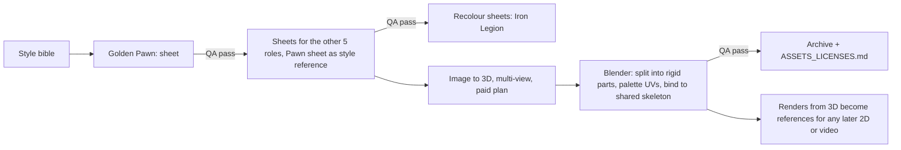

# Character consistency playbook

Back to [README](README.md) · [plan](plan.md). This answers "How would we make characters consistent?" Research basis: [research/generative-video-consistency.md](research/generative-video-consistency.md) §3 (cited as Video), [research/characters-animation.md](research/characters-animation.md) (Characters), [research/design-choreography-production.md](research/design-choreography-production.md) §2 (Design), [research/engine-camera.md](research/engine-camera.md) (Engine). Values marked **(proposal)** are starting points for the owner to approve, not research findings.

## Contents

1. [Short answer](#1-short-answer)
2. [Reconciling the theme with the shared skeleton](#2-reconciling-the-theme-with-the-shared-skeleton)
3. [Style bible, filled in for Clockwork Toybox](#3-style-bible-filled-in-for-clockwork-toybox)
4. [Canonical turnaround sheets](#4-canonical-turnaround-sheets)
5. [Prompt templates and reference-image workflow](#5-prompt-templates-and-reference-image-workflow)
6. [Optional LoRA](#6-optional-lora)
7. [Second army: recolour, do not regenerate](#7-second-army-recolour-do-not-regenerate)
8. [3D rules](#8-3d-rules)
9. [Asset QA rubric and checklist](#9-asset-qa-rubric-and-checklist)
10. [Versioning and archiving policy](#10-versioning-and-archiving-policy)

## 1. Short answer

Consistency comes from a pipeline, not from a clever prompt (Video §0). Every generator, image or video, still drifts on details such as weapons, emblems and the number of crenellations on a rook (Video §1.2). The pipeline:

1. **Write the style bible once** before generating anything (section 3).
2. **Approve one golden character** (the Pawn) end to end before starting the others (Design §5.5).
3. **Make one canonical turnaround sheet per role** and treat it as the single source of truth. Every later generation receives it as a reference; the QA rubric scores against it (Video §3.2).
4. **Use fixed prompt blocks** and change one variable at a time (Video §3.3).
5. **Make the second army by recolouring**, never by regenerating (Video §3.2, Characters §0).
6. **Move to 3D early.** In 3D, identity lives in geometry, one skeleton and one palette, so it cannot drift between scenes (Video §3.7). Any later 2D or video material starts from renders of the 3D model (Video §3.6).
7. **Score every asset** with the QA rubric and keep a rejection log (Video §3.8).
8. **Archive outputs, not just prompts**, because models get retired (section 10).



## 2. Reconciling the theme with the shared skeleton

Design §2.5 proposes a Clockwork Toybox cast with a rocking-horse knight and a castle-on-casters rook. Characters §2.2 recommends that every piece be a humanoid on one skeleton, with a horse-helm knight and a tower-armoured golem rook. Both can hold at once: toys built from rigid parts, each part attached to a standard humanoid bone.

| Role | Design concept (Porcelain Guard / Iron Legion) | Shared-skeleton version used in this plan | Rig notes |
|---|---|---|---|
| Pawn | Drummer boy with toy bayonet / tin trooper with spoon spear | Same: small toy soldier; weapon head is the one per-army kitbash part (bayonet or spoon) | Standard proportions, uniform scale 1.0 |
| Knight | Rocking horse cavalier / tin hobby horse lancer | **Hobby horse lancer for both armies**: a toy soldier "riding" a horse head on a stick, horse head echoes the Staunton knight, short lance | Horse head and stick are a rigid prop on the hips and right hand. Hop clip instead of walk. A true rocking horse would need a non-biped rig; kept as a stretch idea |
| Bishop | Music box cleric with crank organ crozier / clockwork astrologer with orrery staff | Same body: robed cleric with a mitre slit; staff head is the kitbash part (organ crank or orrery) | Rigid robe bell on the hips, legs hidden |
| Rook | Porcelain castle on casters with a soldier in the turret / iron siege tower on treads | **Wind-up tin tower golem**: torso is a tower section, crenellated head, short thick legs, a tiny soldier peeking from a chest hatch | Same bone **names**, but a "heavy" variant of the skeleton (wider shoulders, shorter legs). Clips for the rook are retargeted offline in Blender (Characters §3.4). Treads stay a stretch variant |
| Queen | Ballerina automaton with fan blades / iron sorceress with spinning top skirt | Same body: tall automaton with a rigid spinning-top skirt and spiked crown | Skirt on the hips; spins are procedural rotation plus a clip |
| King | Porcelain king with oversized key / iron king with pocket watch sceptre | Same body: broad crowned king with an oversized wind-up key; sceptre head is the kitbash part | Standard proportions, uniform scale 2.0 relative to pawn |

Rigid parts each weighted 100% to one bone remove skin-weighting problems and suit AI-generated or kitbashed parts (Design §2.3). The bone names follow the reference rig in [section 8](#8-3d-rules), so the CC0 animation libraries apply.

## 3. Style bible, filled in for Clockwork Toybox

Template rows from Video §3.1, filled in with Design §2 decisions. Store this as `art-source/bible/style-bible-v1.md` and version it like an asset.

| Element | Decision |
|---|---|
| Premise | Two armies of wind-up toys fight on the lid of a toy box. Defeat is mechanical: the key spins off, a spring pops, plates crack into a few large chunks, the toy winds down and tips over (Design §2.5) |
| Style | Stylized 3D toy, chunky, clean hard-surface shapes, visible seams and rivets, soft painted wear on edges, no outlines, no painted-in lighting **(proposal)** |
| Shape language | Pawn small and round; knight angular, leaning forward; bishop tall and pointed; rook square and blocky; queen tall and elegant; king broad and crowned (Video §3.1) |
| Height ladder (relative) | Pawn 1.0, Knight 1.4, Bishop 1.6, Rook 1.6 but about twice as wide, Queen 1.8, King 2.0 (Design §2.2) |
| Head proportion | Pawn about 2.5 heads tall, others about 3 to 3.5 heads (toy proportions) **(proposal)** |
| Staunton head echo | Bishop mitre slit, rook crenellations, knight horse head, queen spiked crown, king cross on crown. A chess player must identify every piece from above at 30 to 60 degrees (Design §2.2) |
| Shared motif | Every character has a brass wind-up key on its back (socket `back`), sized by role; it turns in idle and "ready" |
| Base disc | Every unit stands on a round base in the army accent colour; the base carries selection, threat and check rings (Design §2.2) |
| Palette, shared neutrals **(proposal)** | Brass `#B08D57`, key steel `#9AA0A6`, wood `#8A5A3B`, felt base underside `#3A3A3A` |
| Palette, Porcelain Guard **(proposal)** | Porcelain `#F2EBDD`, porcelain shade `#D9CFBF`, enamel blue `#2F6DB5`, gilt trim `#C9A54A` |
| Palette, Iron Legion **(proposal)** | Black iron `#2B2B2E`, gunmetal `#4A4D52`, enamel orange `#E07A1F`, copper trim `#B4693A` |
| Palette rules | Armies differ by **value** (light vs dark) and by **accent** (blue vs orange), never by hue alone (Design §2.2). Accent colour only in fixed zones: base disc rim, sash or cape, plume or crest, headgear trim. Check both armies in greyscale and in a colourblind simulator |
| Materials | Five shared materials with fixed ranges **(proposal)**: glazed porcelain (roughness 0.2 to 0.3), painted tin or iron (roughness 0.4 to 0.6, metallic 0.6 to 0.8), enamel paint (roughness 0.3), brass (metallic 1.0, roughness 0.35), wood (roughness 0.7). Same values on every character (Video §3.1: 4 to 6 materials) |
| Signature props | Pawn: musket with bayonet or spoon spear. Knight: hobby horse and short lance. Bishop: crozier with crank organ or orrery. Rook: cork cannon arm and chest hatch. Queen: fan blades or spinning-top skirt. King: crown, oversized key, sceptre or pocket-watch sceptre (Design §2.5) |
| Lighting for all reference images | Warm key light from front left at about 45 degrees, cool fill from the right, soft rim from behind, plain mid-grey background `#808080`, same focal length for every sheet (Video §3.1) |
| In-game look | One environment map, one tone mapping and grade for board and battle views (Video §3.7) |
| Personality | Pawn eager and jabby; knight a show-off; bishop prim and fussy; rook a slow heavy brute; queen fast and graceful; king reluctant, hides behind others, never dies but "surrenders" (Design §2.5) |
| Do-not list | No real people. No likeness of existing franchises: Interplay Battle Chess characters and gags, Toy Story, Nutcracker designs, holochess creatures, Wizard's Chess pieces (Design §1.3, §2.4). No text or logos. No blood, no humanlike dismemberment or decapitation, no faces showing pain (Design §3.11). No realistic firearms (cork cannon only) |
| Readability tests | Black-fill silhouette test at board scale; greyscale army test; colourblind simulation; view from the default RTS camera at 30 to 60 degrees |

## 4. Canonical turnaround sheets

One sheet per role (6), then recoloured for the second army (12 sheets from 6 designs, Video §3.2).

| Item | Specification |
|---|---|
| Views | Front, three-quarter, side, back, plus a **top-down view at about 45 degrees** (matches the RTS camera) |
| Pose | A-pose, arms about 45 degrees from the body, feet visible (Characters §4.1 step 1) |
| Background and light | Plain mid-grey, lighting from the style bible, no shadows across the body |
| Camera | Same focal length and distance for every sheet; orthographic or long lens look; character centred |
| Scale bar | Height ladder marks, so proportions can be checked across sheets |
| Close-ups | Signature prop, head or headgear, wind-up key, base disc |
| Palette card | Swatches with hex values and the accent zones marked |
| Resolution | At least 2048 px wide per sheet |
| File name | `<role>_<army>_sheet_v<major>.<minor>.png`, for example `pawn_guard_sheet_v1.0.png` |
| Status | `draft`, `approved` or `retired`, recorded in the asset manifest (section 10) |

Approved sheets are the input to image-to-3D (Meshy Multi Image to 3D takes several views, Characters §1.1 and §4.1 step 2) and the reference for every review.

## 5. Prompt templates and reference-image workflow

### 5.1 Choose one image model and keep it

Pick one model for the whole project (README decision 7). Options with reference features (Video §3.4):

| Model | Reference mechanism | Notes |
|---|---|---|
| Gemini 3 Pro Image | Multi-image editing; about $0.134 per 1K or 2K image | Output ownership per Gemini terms; SynthID watermark (Video §3.4, §5) |
| FLUX.2 | Native multi-reference, 2 to 10 images (4 to 6 effective) | Dev weights non-commercial for serving the model; outputs usable commercially; klein-4B is Apache 2.0 (Video §3.4) |
| FLUX.1 Kontext | Single-image instruction editing | Good for recolour and pose edits |
| Midjourney V8.x | `--oref` Omni Reference, up to 4 references in the V8.2 edit model | Some users report weak identity hold (Video §3.4) |

### 5.2 Prompt blocks

Every prompt is assembled from fixed blocks: `[STYLE] + [CHARACTER] + [VIEW or ACTION] + [LIGHTING] + [EXCLUSIONS]` (Video §3.3). Blocks are stored as text files next to the sheets and pasted unchanged. Image models do not follow hex codes reliably; they are included to steer, and colours are corrected afterwards by recolour.

```text
[STYLE]
Stylized 3D toy figure of a clockwork wind-up toy, chunky toy proportions, clean hard-surface
shapes, visible seams and small rivets, glazed porcelain and painted tin materials, soft edge wear,
no outlines.

[CHARACTER: pawn, Porcelain Guard]
Pawn of the Porcelain Guard: a small round drummer-boy toy soldier about 2.5 heads tall, ivory
porcelain body (#F2EBDD), blue enamel jacket and shako (#2F6DB5), gilt trim (#C9A54A), toy musket
with a bayonet in the right hand, brass wind-up key on the back, standing on a round ivory base
disc with a blue rim.

[VIEW]
Full body, A-pose with arms 45 degrees from the body, {front | three-quarter | side | back |
top-down 45 degree} view, orthographic look, centred, feet and base fully visible.

[LIGHTING]
Warm key light from the front left, cool fill from the right, soft rim light from behind, plain
mid-grey background, no cast shadows on the body.

[EXCLUSIONS]
No text, no logo, no watermark, no extra limbs, no blood, no realistic firearms, not resembling
any existing franchise character.
```

For an action frame (previz or marketing only), replace `[VIEW]` with an action block such as `lunges forward with the bayonet, three-quarter view, camera at chest height`.

### 5.3 Workflow

1. **Mood board.** Own sketches and exploratory generations only; no franchise images as references (Characters §6, Video §5).
2. **Golden Pawn exploration.** 20 to 40 generations from the blocks; pick one; refine with instruction edits (one change at a time).
3. **Approve the front view**, then generate each other view with the approved front as a reference image. Check each view by overlaying silhouettes at the same scale.
4. **Assemble the sheet**, score it with rubric rows 1 to 8, approve as `v1.0`.
5. **Other roles.** References are the approved Pawn front and three-quarter views (carrying the style) plus the palette card; text carries the role. Approve one role at a time.
6. **Recolour** for the Iron Legion (section 7).
7. **Image to 3D.** Feed the approved views to Meshy Multi Image to 3D on a paid plan, A-pose, 2 to 4 attempts, keep the best (Characters §4.1 step 2). Record every attempt in the manifest.
8. **Rigid split, palette UVs and skeleton bind (Blender).** The generator delivers one fused mesh with its own PBR textures. Split it into rigid parts (or start from Meshy T2's natively separated parts, Characters §1.1), discard the generated textures and give each part UVs on the army palette, then parent each part 100% to a bone of the reference skeleton (rook: the heavy variant). Budget **4 to 10 h per role for an experienced Blender user, 2 to 3 times that for the owner**. On path B this is freelancer work ([plan.md budget](plan.md#budget)); phase S measures it on one pawn first.
9. **Clips.** CC0 library clips play directly on the reference skeleton. Meshy text-to-motion clips arrive on Meshy's skeleton and must be retargeted to the reference skeleton in Blender; Meshy preset clips are not used ([plan.md conflict 19](plan.md#reconciled-conflicts)).
10. **After 3D exists**, all new 2D images and any video start from renders of the 3D model (first frame, or first and last frame), so identity comes from geometry (Video §3.6).

## 6. Optional LoRA

Use only if reference-based generation keeps drifting on two or more roles after the workflow above (plan.md phase 5).

| Item | Guidance |
|---|---|
| Scope | One style LoRA, or one per role (6, not 12); army colours come from prompt or recolour (Video §3.5) |
| Data | 15 images minimum, 25 to 40 recommended, varied poses and angles, captioned; only approved sheets and QA-passed generations (Video §3.5) |
| Base model license | Determines what you may do: Wan 2.2 Apache 2.0; LTX-2 free under $10M ARR; FLUX.2 dev non-commercial for serving the model (Video §3.5) |
| Cost | Tens of dollars on a cloud trainer **(unverified per-run price, Video §4)**, 6 to 12 h dataset preparation |
| Exclusions | No Hunyuan-based models (EU, UK, South Korea excluded; plan.md conflict 6) |

## 7. Second army: recolour, do not regenerate

Regenerating the Iron Legion from text produces different shapes, which breaks the "same role, two armies" read and doubles QA. Instead:

| Stage | How |
|---|---|
| Sheets | Edit-recolour the approved Porcelain Guard sheet (FLUX.1 Kontext or the chosen model's edit mode): map each palette zone to its Iron Legion colour. Geometry stays identical (Video §3.2) |
| Kitbash part | Swap the one allowed per-army part (weapon head or sceptre head) on its socket; see [plan.md conflict 14](plan.md#reconciled-conflicts) |
| 3D | Same mesh, same UVs; swap the palette texture (section 8). No new rig, no new clips (Characters §4.1 step 3) |
| QA | Rubric row 3 with a colour picker: accents in the right zones, hex within a small tolerance of the bible |

## 8. 3D rules

| Rule | Detail | Source |
|---|---|---|
| Reference skeleton | One humanoid bone-name set for all roles. Use the CC0 Quaternius Universal Base Characters rig, which the Universal Animation Library 1 and 2 (250+ clips) are built on, so library clips apply directly. Verify on the pack pages that both use the same rig before phase 1 | Characters §3.1, §5 |
| Proportions | Standard roles share bone lengths and use uniform object scale for the height ladder; head and torso shells may vary, limb meshes follow bone lengths. The rook uses a "heavy" variant (same names, different lengths), with clips retargeted offline in Blender | Characters §3.4; section 2 |
| Rigid parts | Each mesh part 100% weighted to one bone; extra bones (rook hatch, queen skirt spin) are allowed and animated procedurally | Design §2.3 |
| Sockets | `hand_R`, `hand_L`, `head_top`, `back` (wind-up key), `base`; kitbash props attach here | Video §3.7 |
| Army colours | UVs map onto swatch cells of one palette per army: a small **lossless PNG** (64 to 256 px, nearest filtering, cells of at least 8 px, UVs in cell centres). Army swap is a texture swap. Do not block-compress palettes (ETC1S/KTX2 shifts flat colours and bleeds across cells) | Video §3.7; Design §2.1; plan.md conflict 8 |
| Materials | Only the five bible materials, same roughness and metal values everywhere | Video §3.1 |
| Budget | 3k to 6k triangles, cap 10k; Low set 2k to 4k; at most 65 bones (40 on Low); at most 4 weights per vertex (1 for rigid parts) | plan.md conflict 8; Engine §4.2; Characters §4.2 |
| Orientation | Metres, feet at origin, facing +Z, transforms applied | Characters §4.1 step 4 |
| Naming | `characters/<role>.glb`; mesh parts `<role>_<part>`; one material `M_Palette`; clips `Idle`, `Ready`, `Move`, `Attack_A`, `Attack_B`, `Hit`, `Death`, `Victory` | Characters §4.1 step 4 |
| Lighting | One environment map and one grade for board and battle views | Video §3.7 |

## 9. Asset QA rubric and checklist

### 9.1 Rubric (score 0 to 2 per row against the canonical sheet)

Ship at **16 or more of 20 with no zero in rows 1 to 4** (Video §3.8). Two reviewers, side by side with the sheet; keep a rejection log naming the failing row so prompts or references can be fixed.

| # | Criterion | 0 | 1 | 2 |
|---|---|---|---|---|
| 1 | Silhouette identifies the piece in a black fill at board scale | Ambiguous | Readable with colour | Instantly readable |
| 2 | Signature prop matches the sheet (shape, hand, size) | Wrong or missing | Minor deviation | Exact |
| 3 | Army palette: accents in the correct zones, hex within tolerance | Wrong army colours | Shifted hue or zone | Matches |
| 4 | Proportions and height ladder | Off by more than one head | Slight | Matches |
| 5 | Face or headgear design | Different character | Similar | Same |
| 6 | Materials (porcelain vs tin vs brass vs wood) | Wrong | Mixed | Matches |
| 7 | Style (shape detail, seams, wear) vs bible | Different style | Close | Same |
| 8 | Lighting and grade | Different | Close | Same |
| 9 | Temporal stability in animation: no popping, prop swaps, interpenetration | Visible problem | Brief flicker | Stable |
| 10 | Artifacts: extra limbs, merged parts, text, watermarks | Present | Minor, fixable | None |

### 9.2 Technical checklist per character (Characters §4.2, adjusted to this plan)

- [ ] Reads as its chess piece from the default camera at board scale, in both armies
- [ ] Triangles within budget; one material (`M_Palette`); lossless PNG palette only, colours checked with a colour picker
- [ ] Bone names match the reference skeleton; at most 65 bones; rigid parts weighted to one bone
- [ ] Feet at origin, faces +Z, metres, transforms applied
- [ ] No floating geometry, inverted normals or visible seams in the palette mapping
- [ ] All tier-1 clips play; Idle and Move loop cleanly; foot sliding within tolerance at the configured walk speed
- [ ] Attack clips have `impactTime`; reaction clips have `expectedHitTime`; Death ends in a stable pose
- [ ] Compressed character GLB (mesh and skin) at most 0.8 MB
- [ ] Khronos glTF Validator: no errors
- [ ] Manifest complete and line added to `ASSETS_LICENSES.md` (source, plan, date, license)

## 10. Versioning and archiving policy

**Why.** Generative vendors change quickly. The Sora API was switched off on 2026-09-24 with no migration target (Video §1.1). CSM shut down in January 2026 (Characters §1.1). Meshy retires `meshy-5` on 2026-10-10 and `lowpoly` on 2026-10-30 (Characters §1.1). Prompts and seeds are not reproducible across model versions, so a prompt is not a backup (Video §1.2, §3.3).

**Policy**

1. **Archive every kept output immediately**: images, raw generator downloads, cleaned meshes, Blender files. Never rely on a vendor's web library as storage.
2. **One manifest per asset** (JSON or YAML next to the file):

   ```yaml
   id: pawn_guard_sheet
   version: 1.0
   status: approved            # draft | approved | retired
   tool: gemini-3-pro-image    # exact model id as shown by the vendor
   created: 2026-11-03
   plan: paid                  # free-tier outputs: record the CC BY 4.0 obligation
   license: vendor terms snapshot 2026-11-01 (art-source/terms/)
   prompt_blocks: [STYLE v1, CHARACTER pawn_guard v1, VIEW front, LIGHTING v1, EXCLUSIONS v1]
   references: [pawn_guard_front_v0.9.png]
   seed: null                  # if exposed
   human_edits: "recoloured shako, fixed bayonet length in edit pass"
   qa: { reviewer_a: 18, reviewer_b: 17, rows_failed: [] }
   ```

3. **Version numbers**: major for a design change (re-run QA, re-approve), minor for fixes. Never overwrite; retired versions stay in the archive.
4. **Where**: art sources live **outside the public game repo** (a private repo or a versioned cloud folder), with a second copy locally. The public repo holds only shipped GLBs, textures, `clips.json` and `ASSETS_LICENSES.md`. Do not rely on Git LFS for files GitHub Pages must serve; verify current Pages behaviour first if LFS is considered.
5. **Open formats**: PNG, GLB, FBX and `.blend`. Nothing that only opens in one vendor's tool.
6. **Terms snapshots**: save the vendor's terms and pricing pages (PDF) on the day you subscribe and when you generate final assets. Several facts in the research were unverifiable because pages blocked fetchers (Characters §7).
7. **Quarterly vendor check**: model retirements, terms changes, price changes. Keep an exit note per vendor (for Meshy: archived sheets plus GLBs let Tripo, Rodin or a freelancer continue).
8. **Human contribution record**: keep notes of edits, selection and arrangement; they support copyright in the final assets, since purely generated material is not protected in the US (Characters §6, Video §5).

Suggested layout:

```
art-source/                     (private)
  bible/      style-bible-v1.md, palette-card.png, prompt-blocks/*.txt
  terms/      meshy-terms-2026-11-01.pdf, ...
  roles/pawn/
    sheets/   pawn_guard_sheet_v1.0.png (+ .yaml), pawn_legion_sheet_v1.0.png
    gen/      2026-11-03_gemini-3-pro-image_pawn-front_017.png (+ .yaml)
    mesh/     pawn_meshy-7.1_attempt3_raw.glb (+ .yaml)
    blend/    pawn_v1.2.blend
  rejections.md
```
