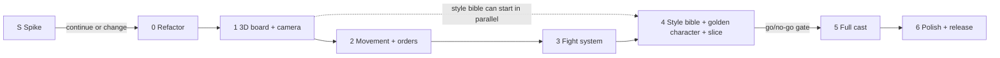
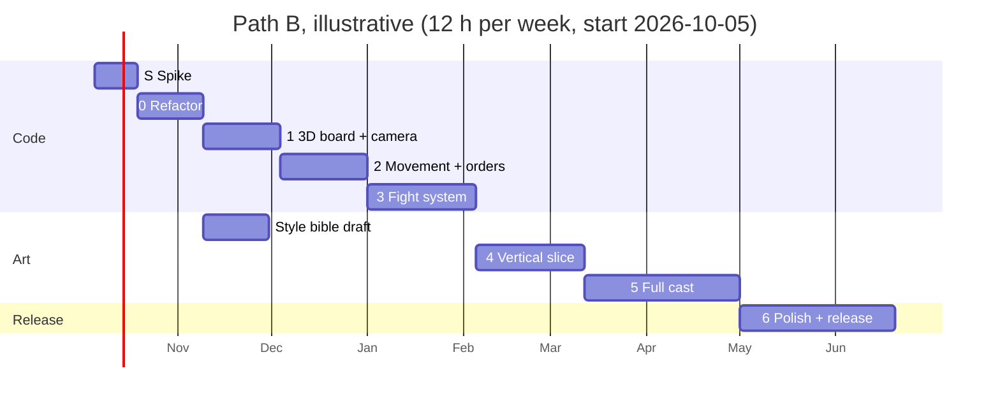

# 3D battle mode: delivery plan

Back to [README](README.md). Technical detail is in [architecture.md](architecture.md); art pipeline detail in [character-consistency.md](character-consistency.md).

Source shorthand used below. Every number either links to one of these or is marked **(estimate)** with the reasoning next to it.

| Label | Report |
|---|---|
| Engine | [research/engine-camera.md](research/engine-camera.md) |
| Characters | [research/characters-animation.md](research/characters-animation.md) |
| Video | [research/generative-video-consistency.md](research/generative-video-consistency.md) |
| Design | [research/design-choreography-production.md](research/design-choreography-production.md) |

Assumptions: the owner works about 10 to 15 hours per week (12 used for calendars) with AI coding assistants, as in Design §5.3. Hours are owner hours, including prompting, reviewing and testing AI-written code, and assume **no prior three.js or Blender experience**. Freelancer hours are separate and paid in cash. Every path carries a **30% cash contingency** (see [Budget](#budget)).

## Contents

1. [Phase overview](#phase-overview)
2. [Reconciled conflicts](#reconciled-conflicts)
3. [Phase S (spike) and phases 0 to 6](#phase-s-spike-prove-the-riskiest-assumptions-first)
4. [Cross-phase work and out of scope](#cross-phase-work-audio-vfx-playtests)
5. [Milestone timeline](#milestone-timeline)
6. [Budget](#budget)
7. [Risk register](#risk-register)
8. [Asset list](#asset-list)

## Phase overview

| Phase | Goal | Owner hours (path B) | Gate question |
|---|---|---|---|
| S. Spike | Throwaway page: one Meshy pawn on the shared skeleton, one canned fight, real phones, 3 viewers | 15 to 25 | Is it fun, on-model and fast enough to continue? |
| 0. Foundation refactor | Move the state transition out of `ui.js`; views become swappable | 20 to 30 | Do the tests pass with only the listed, deliberate changes? |
| 1. 3D board and camera | Playable 3D board with CC0 placeholder characters | 25 to 40 | Does it run at 30 fps on the reference phones? |
| 2. Movement and orders | Units turn, walk, hop, castle; RTS-style ordering | 30 to 50 | Can a new player make moves without help? |
| 3. Fight system | Duel anchor, impact-synced composed fights for all 30 pairings, CC0 clips | 35 to 60 | Do fights line up, and do testers keep them on? |
| 4. Art direction and vertical slice | Style bible, golden character (Pawn), Rook, 2 bespoke scenes, final board | 35 to 60 | **Main go/no-go**: does the art pipeline produce on-model characters at the expected cost? |
| 5. Full cast | Knight, Bishop, Queen, King in both armies, specials, more bespoke scenes | 50 to 90 | Within budget? |
| 6. Polish and release | Performance, mobile, minimap, keyboard play, accessibility, legal, release as "3D (beta)" | 50 to 100 | Release checklist green? |
| Cross-phase | Audio, VFX authoring, playtest recruiting (phases 3 to 6) | 35 to 65 | |

Phase S answers the expensive unknowns (does a generated toy mesh survive the rigid-part rig, do CC0 clips look right on toy proportions, is a 3D fight fun, does a phone hold 30 fps) for under $40 before any refactor. Phases 0 to 3 use only free CC0 assets and are identical on every budget path. They are worth doing even if the bespoke art never happens: the game gets a working 3D mode with placeholder characters.

## Reconciled conflicts

The four reports were written independently. Where they disagree, this plan takes the decision below.

| # | Topic | What the reports say | Decision | Reasoning, and how to verify if unverified |
|---|---|---|---|---|
| 1 | Fight and move length | Design §3.4: capture Full 2.5 to 4.0 s, Fast about 1.2 s, Instant about 0.4 s. Engine §3.2: 0.6 s for a one-square move, 1.5 s max for long moves, "plus fight time". Current 2D Full is about 1 s (repo README) | Non-capture moves: 0.6 s per square at the start, capped at **1.2 s** (run for long slides). Captures: **Full target 2.5 to 3.5 s, hard cap 4.0 s**, with the approach inside that budget (max 0.8 s, Design §3.3). Fast about 1.2 s, Instant about 0.4 s. **Default: "First time Full, then Fast"** per pairing. AI vs AI keeps today's 2D rule: Fast unless the player picked a mode explicitly, and never any camera moves (conflict 20) | The two reports measure different things (locomotion vs a whole capture), so they are compatible. The 1.2 s move cap is tighter than Engine's 1.5 s because every predecessor was criticised for slowness (Design §1.2). Verify in phase S and phase 3 playtests: if more than half of testers switch fights to Fast or Off in their first game, shorten Full |
| 2 | Number of clips | Characters §4.1 step 6: about 8 clips per piece, about 50 total. Design §5.1: 16 to 17 per role, about 120 to 125 total | Two tiers. **Tier 1: 8 clips per role (48) plus 2 king event clips plus 2 bespoke scenes = 54**, built in phases 3 to 5. **Tier 2: up to about 120 to 125** (Design's list), added only where playtests show repetition, queen and rook first | Characters counts what a scene needs to work; Design counts what it needs to stay fresh over many games. Building tier 1 first keeps the cost of a failed pipeline small |
| 3 | Theme vs skeleton guidance | Design §2.4 to 2.5: Clockwork Toybox, rocking-horse knight, castle-on-casters rook, segment rigs. Characters §2.2: keep every piece humanoid on a shared skeleton (knight in a horse-head helm, rook as a tower-armoured golem) | **Toybox theme on one shared humanoid skeleton.** Knight: toy lancer riding a hobby horse (the horse is a rigid prop between the legs, so the rig stays a biped). Rook: wind-up tin tower golem, crenellated head, stubby legs. All parts rigidly weighted to standard bone names. The tank-on-treads rook stays a stretch variant | Rigid parts on standard bone names give both benefits: toy look and easy weighting (Design §2.3), and one animation library for all roles (Characters §2.2). Details in [character-consistency.md §2](character-consistency.md#2-reconciling-the-theme-with-the-shared-skeleton) |
| 4 | Cost and time | Characters §4.3: $40 to $150 and 45 to 110 h for 6 characters with library animation. Video §4: generation fees tens to low hundreds of dollars, 40 to 120 h of 3D cleanup. Design §5.3 to 5.4: 22 to 34 weeks part time; $0 to $500 (AI and CC0), $10k to $25k (hybrid), $25k to $60k (freelance) | Use Characters and Video for **tool cash** (small), Design for **freelance rates** and **scope**. Path totals in [Budget](#budget) are built bottom up from Design's own unit rates, plus 30% contingency. Recommended hybrid is scoped "lean" at about $5k to $27k. Design's summary totals ($10k to $25k hybrid, $25k to $60k freelance) do **not** reconcile with its own unit rates (recomputed: about $18k to $66k and $36k to $135k); this plan uses the recomputed figures | The reports agree that generation fees are small and human cleanup and animation are the real cost. They differ because Characters excludes code, bespoke scenes and non-humanoid keyframing. Freelance rates in Design §5.4 are partly from search snippets **(unverified)**: get 2 to 3 quotes for the golden character in phase 4 before committing |
| 5 | Mixamo licensing for a public web repo | Engine §6 lesson 5: whether a public repo counts as redistribution is unverified. Characters §3.1, §6: risky, do not commit. Design §5.2: prefer CC0. Video §2(b): free and royalty-free for games | **Do not use Mixamo characters or animations in anything shipped or committed.** Allowed only for private, uncommitted experiments | A web game serves the GLB files to every browser and the repo is public (`github.com/d57udy/Chess-game-vibe-code`). CC0 libraries (Quaternius UAL 1 and 2, KayKit, 250+ clips) cover the same needs (Characters §3.1, §5). Adobe's FAQ blocked the researchers' fetchers; if Mixamo is ever wanted, read the FAQ directly and ask Adobe in writing |
| 6 | EU-excluded licenses | Characters §1.1, §3.2, §6: Hunyuan3D open weights and HY-Motion exclude the EU, UK and South Korea (license files cited). Video §2(b) marks HY-Motion unverified; Video §1.1 and §5: HunyuanVideo excludes them too, including outputs | **Exclude all Tencent Hunyuan open-weight models** (Hunyuan3D 2.x, HunyuanVideo, HY-Motion) from the pipeline | The owner may be in the EU and players certainly are. Characters cites the HY-Motion license file directly [48], so treat Video's "unverified" as resolved. Hosted Hunyuan 3.x APIs have separate terms; not needed, so not evaluated |
| 7 | Meshy free tier outputs are CC BY 4.0 and public | Characters §1.1, §6: free tier outputs CC BY 4.0, paid outputs private with full rights; whether upgrading re-licenses earlier free outputs is unverified | **Generate every shipped asset on a paid plan.** Free tier only for throwaway tests. If a free-tier output is ever kept, credit it in `ASSETS_LICENSES.md` as CC BY 4.0 | Avoids attribution obligations and public exposure of the designs. Verify on the Meshy pricing and terms page the week you subscribe, and record the plan and date per asset |
| 8 | Polygon and texture budget | Engine §4.2: 5k to 10k triangles desktop, 2k to 4k mobile, 1024 px KTX2 per character type. Characters §4.2: 5k to 15k, 1024 to 2048. Design §2.1, §5.1: 1.5k to 5k, one palette atlas per army | **Target 3k to 6k triangles per character, cap 10k; low-quality set at 2k to 4k. One small lossless PNG palette per army (64 to 256 px, nearest filtering, swatch cells of at least 8 px); KTX2 only for painted textures such as the board** | The toy style is flat-coloured hard surface, which needs fewer triangles and no per-character PBR texture sets (Design §2.1). The cap keeps room for Engine's scene budget (under 400k desktop, 150k mobile). Block compression (ETC1S) shifts flat swatch colours and bleeds across cells, which would fail the QA rubric's palette row; a tiny PNG costs almost nothing |
| 9 | Per-character download | Characters §4.2: 1.5 to 3 MB per character GLB including clips (that is 9 to 18 MB for 6). Engine §4.2: first playable 3D under 10 MB desktop, under 5 MB mobile | **Character GLBs carry mesh and skin only; clips live in shared animation GLBs** (possible because all roles share bone names). Fight clips load lazily on first capture (Engine §4.4) | Shared clips are stored once instead of six times. Budget in [architecture.md §10](architecture.md#10-asset-loading-and-compression-budget). Verify with `gltf-transform inspect` at the end of phase 1 |
| 10 | Camera controls | Engine §2.2: Q/E rotate 45 degrees, `T` top-down, one-finger drag rotates on mobile. Design §4.1: Q/E snap 90 degrees, Tab toggles top-down, two-finger twist rotates on touch | **Q/E rotate 90 degrees** (aligns with board edges); right-drag free orbit. **`T` for top-down** (Tab stays for keyboard focus, needed for accessibility). Touch: **one-finger drag rotates**, pinch zooms, two-finger drag pans, tap selects (8 px threshold) | 90 degree steps give four canonical views; Tab must not be hijacked. One-finger rotate follows Engine's reasoning that rotation is the common need on a small board. Confirm with the phase 2 usability test |
| 11 | Castling choreography | Engine §2.5: king first, rook walks around (off the rank) with 0.2 s overlap. Design §3.7: rook rolls past, king hops over it | **Default: Engine's version** (king walks, rook steps half a square off the back of the board, passes behind, steps in). Design's "king hops over rook" is an optional Full-mode flourish in phase 5 | Engine's path needs no special clip and works with a walking golem rook. The hop needs a bespoke paired clip |
| 12 | Bespoke paired scenes | Characters §3.5: 3 to 6 showpieces. Design §3.6: 6 to 8 | **2 in the vertical slice (Rook x Rook "sumo shove", Pawn x Pawn en passant), 4 on lean path B, cap 8** | The slice pairings only need the two slice characters. Most players see common pairings, so variants for queen and rook beat more bespoke scenes (Design §1.2 lesson 4) |
| 13 | Root motion in fight clips | Engine §3.1: keep root translation for lunges, then snap. Characters §3.5 and Design §3.3: in-place attack clips aligned on an anchor | **All library and composed clips in place; lunges are driven by code** (an offset curve on the attacker toward the anchor). **Bespoke paired clips keep root motion** relative to the shared pair origin | Code-driven roots are deterministic and testable (Engine §3.1). Paired clips are authored together, so their root motion is already consistent |
| 14 | Army differentiation | Design §2.5: different mesh details per army (drummer boy vs tin trooper). Characters §0 and Video §3.2 and §3.7: same mesh, second army by material or recolour | **Same mesh per role for both armies; army by material set and value (light vs dark) plus accent; at most one swappable kitbash part per role** (for example hat or weapon head) on a shared socket | Halves modelling and QA. Design's army names and personalities stay, carried by materials, parts and barks |
| 15 | Army palette | Video §3.1 example: ivory and gold vs obsidian and crimson. Design §2.2, §2.4: light vs dark by value, blue vs orange accent (colourblind safe) | **Design's version**: Porcelain Guard ivory with blue enamel; Iron Legion black iron with orange enamel | Red vs green deficiencies are the most common; blue vs orange plus a value difference stays readable (Design §2.2). Verify with a colourblind simulator on the first turnaround sheet |
| 16 | Meshy image-to-3D credit cost | Characters §1.1: 25 credits (Meshy 7), 20 (Meshy 6). Video §2(c): about 30 credits, about $0.60 on Pro | Budget **30 credits per attempt** | Small difference; the higher figure is the safer budget. Prices change monthly |
| 17 | Schedule | Design §5.3: 22 to 34 weeks part time for 5 phases | **About 25 to 43 weeks for path B**, built bottom up from phase hours including the spike, cross-phase audio and VFX work, and assuming no prior three.js experience | Longer than Design's range because Design omitted the spike, audio, VFX and the Blender rig work. Path A is longer still, see [Budget](#budget) |
| 18 | Placeholder pack and reference skeleton | Characters §5: fastest prototype is KayKit Adventurers + Skeletons + KayKit Character Animations (one rig, weapons included). Characters §3.1 and Design §5.2: Quaternius Universal Animation Library 1 and 2 (250+ clips, Mixamo-compatible universal rig) | **Quaternius Universal Base Characters + UAL 1 and 2 from phase 1**, as the reference skeleton the final cast is also built on. KayKit only if Quaternius bodies prove unusable as placeholders. UBC bodies are about 13k triangles (Characters §5), so 32 of them slightly exceed Engine's 400k scene budget: acceptable for desktop placeholders; make a decimated copy (`gltf-transform simplify`) for Low | Tagging fight clips (impact times, hit types) in phase 3 is work that should carry over to the final cast; that only happens if placeholders and final characters share a skeleton. Verify on the Quaternius pages that UBC and UAL use the same rig, and check whether the free tier includes everything needed (tier prices differ between pages, Characters §5) |
| 19 | Meshy preset animations | Characters §3.1: Meshy's 631 preset clips are fine for a public repo "on paid plan (your output)" | **Meshy preset clips are treated like Mixamo** (not shipped, not committed) until Meshy's terms explicitly cover redistribution of preset motion data. Meshy text-to-motion outputs count as your own outputs. Any Meshy clip must also be retargeted to the reference skeleton | Presets are Meshy's library content, not user output, so they raise the same redistribution question as Mixamo. The plan does not depend on them: CC0 libraries, text-to-motion and keyframing cover the clip list. Verify on Meshy's terms page; the pricing page confirms only that paid users own "assets you create" |
| 20 | Pacing setting names and AI vs AI | 2D build: one setting Full / Fast / Off in `localStorage` key `chess.battleMode`, Full about 1 s; AI vs AI uses Fast unless the player set a mode. First draft of this plan: 3D Full / Fast / Instant, AI vs AI "always Fast", and a "global speed multiplier as in the 2D build" (none exists) | **One shared setting** (`chess.battleMode`) for both views with values Full, Fast, Off, plus a new value "First time Full". In 3D, Off means the Instant beat (0.4 s slide and fade). 2D treats "First time Full" as Full. AI vs AI keeps the existing 2D rule; battle camera moves are always off in AI vs AI. No separate speed multiplier | One setting avoids two sources of truth and keeps the existing stored preference working |
| 21 | Battle Chess trademark facts | Design §1.3: Reg. 6610412 live; 2012 TopWare case; Reg. 6124855 "cancelled after an opposition ... (unverified)" | Interplay holds Reg. 6610412 (verified live by the plan review) and enforced the mark in 2012 (TopWare) and in 2021, when **Interplay itself** petitioned to cancel a third party's BATTLE CHESS board-game registration (Reg. 6124855) and won by default (TTAB 92077183, verified by the plan review) | The research described the 2021 case the wrong way round. A correction note is added to the research copy |
| 22 | Characters report hours | Characters §0: 25 to 50 hours; Characters §4.3: 45 to 110 h | **Use 45 to 110 h** (the detailed table) | §0 is a summary that does not match the table; a footnote was added to the research copy |

## Phase S. Spike: prove the riskiest assumptions first

**Goal.** Before refactoring anything, find out in a throwaway page whether the core idea works on real devices and whether the owner likes it. Everything in this phase is disposable; nothing is merged into the game.

**Tasks**
1. `spike3d.html` (not linked from the game, not merged): import map with `three@0.186.1` and `camera-controls@3.1.2`, an 8x8 board, the camera rig from [architecture.md §5](architecture.md#5-camera) (rotate, zoom, pan, snap to White and Black).
2. One Pawn generated with Meshy on a paid month (Characters §1.1), cleaned enough to weight its rigid parts to the reference skeleton (Quaternius Universal Base Characters, conflict 18).
3. Three CC0 clips from the Quaternius Universal Animation Library on that pawn: idle, walk, one melee attack, plus a hit and a death reaction from the same library.
4. One canned Pawn x Pawn capture: attacker walks two squares, impact-synced fight on a duel anchor ([architecture.md §9](architecture.md#9-duel-anchor-and-impact-synced-clips)), victim dies, attacker steps in. Hard-coded, no rules integration.
5. Measure on the two reference phones (owner picks one older Android and one iPhone) and the owner's laptop: frame rate with the pawn cloned 32 times, download size.
6. Optional: Veo 3.1 Lite previz of 3 to 5 pairings to calibrate fight timing (about $0.05 per second, Video §4; moved here from phase 3).
7. Show the page to 3 people (one chess player, one non-player, one gamer) and note reactions.

**Deliverables.** `spike3d.html` on a branch or a scratch folder; a one-page spike report: frame rates, MB, hours spent, what broke, the 3 reactions, recommendation.

**Acceptance criteria**
- The canned capture plays end to end on all three devices without errors.
- Frame rate, download size and hours are written down.
- The owner has a recorded continue, change or stop decision.

**Effort.** 15 to 25 h. Cash under $40 (one month of Meshy Pro at $20, Characters §1.1; Veo previz under $10, Video §4). Same on every path.

**Dependencies.** None. Runs before phase 0.

**Continue, change or stop**
- **Continue** to phase 0 if: the pawn is on-model against its concept image (QA rubric rows 1 to 4 have no zero, [character-consistency.md §9](character-consistency.md#9-asset-qa-rubric-and-checklist)), the CC0 clips look acceptable on its toy proportions, at least 30 fps on both reference phones with 32 cloned pawns, the fight reads as one synchronized hit (no visible gap or overlap at contact), the Meshy pawn reaches a usable rigid-part rig in under 6 h, and at least 2 of the 3 viewers want to see more.
- **Change** if: phones are under 30 fps (plan desktop-only 3D, README decision 6), or the Meshy pawn needs more than 6 h of cleanup (plan path B from the start for meshes), or the fight timing feels wrong (adjust the pacing targets before phase 3).
- **Stop** (keep the 2D game, which already has capture scenes) if: the owner does not enjoy the result, or the laptop cannot hold 60 fps with 32 pawns, or the spike exceeds 40 h without a working capture.

## Phase 0. Foundation refactor

**Goal.** Separate "apply a move to the game state" from "show the move", so a 3D view can be added without touching the rules. No visible change for players.

**Tasks**
1. Split the state transition into two functions in `gameLogic.js` ([architecture.md §2](architecture.md#2-the-applymove-refactor)):
   - `applyMoveCore(state, move)`: the pure position transition (board, castling rights including a rook captured on its home square, en passant target, clocks, side to move). No history, no end-of-game evaluation, no notation. Point the perft harness in `tests/unit/gameLogic.test.js` (`perftMake`) at it, so perft exercises the same code the game uses.
   - `applyMove(move)`: validates the move, calls `applyMoveCore` on the live globals, adds notation, pushes history, evaluates check, mate and draws, and returns a `MoveResult`. Move `evaluateGameState()` and the check preview logic out of `ui.js` with it.
2. Unify the third move-application path: `ChessAI.applyMoveToGlobals()` (`aiPlayer.js` line 978, used by tests and self-play) goes through the engine's own `makeMove` and `writeToGlobals`. Either route it through `applyMove`, or add a test that both paths produce identical globals over a set of games (including castling, en passant and promotion). The engine's internal `makeMove` and `perft` stay as they are; they are tuned for search speed.
3. Create `controller.js` (classic script) holding turn flow, AI requests, review mode, undo/redo and the `positionVersion` cancellation pattern that `ui.js` uses today. Keep a global `isAnimating` as an alias of the controller's busy flag, because tests and `ui.js` read it.
4. Wrap the current DOM board plus `BattleFX` as `View2D` implementing the view interface ([architecture.md §3](architecture.md#3-view-interface)).
5. Add a small event bus (`moveStarted`, `captureImpact`, `moveFinished`, `gameOver`, ...). Sounds, the status line and the move list update on **`moveFinished`**, not when `applyMove` returns, so the move list still shows the move only after its animation, as today.
6. Add the new scripts (`events.js`, `controller.js`, `view2d.js`) to `index.html` **and** to the script list in `tests/helpers/loadDom.js` (it loads the classic scripts by name, currently `gameLogic.js`, `aiPlayer.js`, `aiClient.js`, `battleFx.js`, `ui.js`).
7. Tests: unit tests for `applyMoveCore` and `applyMove` (both castles, castling rights after a rook is captured on its home square, en passant, promotion with and without capture, 50-move clock, check, mate, stalemate, notation); controller tests with a `FakeView`.
8. Add a hidden `?view=3d` URL flag and an empty `ASSETS_LICENSES.md`.

**Deliverables.** One PR: "Extract applyMove and view interface". Updated README file table.

**Acceptance criteria**
- `npm test` passes. Existing integration tests in `tests/integration/ui.test.js` pass without weakening, with one **deliberate, reviewed change**: the test "a move locks input until its animation finishes" asserts `currentMoveIndex === 0` during the animation. With `applyMove` the history entry exists from the start, so the expected value becomes 1; the assertion that undo and navigation are ignored during the animation stays. Any other changed assertion needs a written reason in the PR.
- Perft results unchanged, now computed through `applyMoveCore`.
- `applyMoveToGlobals` and `applyMove` agree on every position of the equivalence test (task 2).
- `ui.js` no longer calls `setPieceAt` or mutates `castlingRights`, `enPassantTarget` or clocks (checked with `grep`).
- The move list and status line change only after the move animation ends (integration test).
- Manual 2D checklist passes: capture with scene, castling both sides, en passant, promotion dialog including cancel, undo and redo, history review and "Resume from here", AI vs AI for 50 moves, skip a scene.

**Effort.** 20 to 30 h (all paths; raised from the first draft because of tasks 2 and 6). Freelancer: optional 2 h code review by a JS developer.

**Dependencies.** Phase S result is "continue" or "change".

**Exit or kill criteria.** If after 30 h the refactor still breaks integration tests, stop and use the fallback: leave `makeMove` in place and have it emit the same `MoveResult` as an event for the 3D view. Less clean, but unblocks phase 1.

## Phase 1. 3D board and camera with CC0 placeholders

**Goal.** A playable 3D view of the real game with an RTS-style camera, using free characters.

**Tasks**
1. Import map with pinned `three@0.186.1` and `camera-controls@3.1.2`; load the 3D view by dynamic `import()` only when the player turns 3D on (Engine §4.4).
2. Scene: board (64 squares), simple table environment, one directional light with shadow (1024 px mobile, 2048 px desktop), environment light.
3. Camera rig per [architecture.md §5](architecture.md#5-camera): clamped pitch and distance, board-bounded target, snaps (`1` White, `2` Black, `T` top-down, Home reset), Q/E 90 degree steps, smooth transitions.
4. Load CC0 placeholders on the **reference skeleton**: Quaternius Universal Base Characters with Universal Animation Library 1 and 2, tinted per army (Characters §5; conflict 18). Clone per unit with `SkeletonUtils.clone`. Idle loops.
5. `render(position)` places all units; picking via invisible square and capsule proxies; click own unit, legal squares highlight via `generateLegalMoves()`, click a square to move (units may simply slide in this phase).
6. Render on demand (only while something animates or the camera moves).
7. Feature detection and fallback to 2D (no WebGL 2, context loss, low frame rate in the first seconds) with a short message.
8. Settings: "View: 2D / 3D (beta)", "Quality: High / Low".
9. Dev-only overlay with fps, draw calls, triangles.
10. Keep the download small from day one: export only the about 15 clips actually used into `anims/core.glb` (the UAL packs hold 250+), and make a decimated copy of the placeholder bodies for Low (about 13k triangles each, Characters §5).
11. Test plumbing: add `"tests/**/*.test.mjs"` to the npm test scripts (today they only match `*.test.js`, so 3D tests would be silently skipped) and put a `package.json` with `"type": "module"` in `view3d/` so Node treats those files as ES modules while the root package stays CommonJS ([architecture.md §12](architecture.md#12-testing-strategy)).
12. 3D needs the page served over http(s). On `file://` the AI runs on the main thread (README "Running locally") and would stall rendering, so the 3D option shows a short "serve the folder to use 3D" note instead.

**Deliverables.** 3D view behind the setting; `ASSETS_LICENSES.md` lists every CC0 file; first Playwright screenshot test, run locally (CI is optional, phase 6).

**Acceptance criteria**
- A full game against the AI can be played in 3D; switching 2D and 3D mid-game keeps the position, selection is cleared, no console errors.
- Measured first 3D load (DevTools, cache disabled): at most 10 MB desktop, at most 5 MB with Low quality (Engine §4.2).
- 60 fps on the owner's laptop and at least 30 fps on the two reference phones (owner picks one older Android and one iPhone) with 32 idle units.
- The camera cannot go below the board, lose the board off screen, or zoom through it (try for 2 minutes).
- With WebGL disabled (browser flag) the game stays in 2D and shows the fallback message.
- Playwright screenshots from the White and Black snaps match the stored baseline within a small tolerance. Headless Chromium needs `--enable-unsafe-swiftshader` (or `--use-angle=swiftshader`) since Chrome removed the automatic software WebGL fallback; baselines are generated on the same OS that checks them.
- `npm test` runs the new `*.test.mjs` files (visible in the test count).

**Effort.** 25 to 40 h (all paths). Freelancer: none.

**Dependencies.** Phase 0 (or its fallback).

**Exit or kill criteria.** If the reference phones stay under 30 fps with Low quality and shadows off, make 3D desktop only (README decision 6) and continue. If the module/classic-script bridge or three.js itself proves unworkable, spend at most 8 h on a Babylon.js 9 spike (Engine §1.3 runner-up) before deciding.

## Phase 2. Movement and orders UX

**Goal.** Units behave like units: they acknowledge orders, turn, walk, hop and settle; the player can read the board and give orders comfortably.

**Tasks**
1. Unit state machine ([architecture.md §7](architecture.md#7-unit-state-machine)).
2. Movement per [architecture.md §8](architecture.md#8-movement-rules): turn to face (about 0.2 s), walk at 1.5 to 2 squares per second switching to run for long slides, settle and snap to the square centre; knight parabolic hop (peak about 0.6 square, 0.6 to 0.8 s); castling with rook detour; en passant positioning; promotion model swap with a placeholder effect.
3. Order UX (Engine §2.4, Design §4.2): hover base highlight, selection ring plus "ready" clip, legal markers (dots for moves, crossed swords for captures, icons for castling, en passant, promotion), path preview on hover (line for sliders, arc for the knight), click to order, Escape to deselect, muted display of enemy moves.
4. Readability (Design §2.2, §4.3): coloured base discs carrying selection, check pulse and last-move tint; occluding units dither fade; optional floating glyph labels.
5. AI move presentation: 0.3 s selection ring on the AI's unit before it moves (Design §4.5).
6. Review mode and undo: units slide to positions with no fights; captured units fade back in (Design §4.6).
7. `aria-live` announcements of moves using the existing notation (cheap; the minimap and full keyboard play move to phase 6).
8. Skip (click, key) as in the 2D build. Speed comes from the pacing setting (conflict 20); there is no separate multiplier.

**Deliverables.** Movement module with tests; updated settings; short usability test notes.

**Acceptance criteria**
- Stepped-clock tests ([architecture.md §12](architecture.md#12-testing-strategy)) assert unit positions at given times for: one-square move, long slide, knight hop, both castles, en passant, promotion.
- A one-square move takes 0.6 s (plus or minus 0.1 s); queen a1 to h8 takes at most 1.2 s.
- During castling no two unit capsules intersect at any sampled frame (automated).
- Skip ends the move within one frame and the scene matches `render(position)` exactly.
- Usability: 3 to 5 people who have not seen it make 10 legal moves each without help within 2 minutes; fewer than 1 in 10 clicks selects the wrong unit.
- Moves are announced through `aria-live`.

**Effort.** 30 to 50 h (all paths). Freelancer: none.

**Dependencies.** Phase 1.

**Exit or kill criteria.** If testers misclick more than 1 in 10 orders, turn on the "confirm move" second click by default before moving on (Design §4.2). If movement makes games feel slow in testing, lower the move cap to 0.9 s.

## Phase 3. Fight system with the duel anchor (CC0 assets)

**Goal.** Every capture plays a synchronized fight from a small library, at three pacing levels, without ever blocking the game.

**Tasks**
1. Duel anchor and distance classes (melee about 0.7 square, reach about 1.0, ranged 1.5 or more) per [architecture.md §9](architecture.md#9-duel-anchor-and-impact-synced-clips).
2. `clips.json` metadata: per attack clip `impactTime`, `hitType`, `reach`; per reaction clip `expectedHitTime`.
3. Composition rule (Design §3.2): bespoke pair if present and allowed, else approach + attack variant + finisher + death by hit group. With CC0 clips: pick the closest KayKit or Quaternius melee clips and tag them.
4. Hit-stop (about 35 ms light, 70 ms heavy, 90 ms finisher, cap 120 ms) and light screen shake on finishers (Design §3.10).
5. Placeholder VFX (impact star, dust puff, gear burst) and sounds (reuse `capture.mp3` until phase 6).
6. Pacing from the shared `chess.battleMode` setting (conflict 20): Full, Fast, Off (Instant beat in 3D) and the new "First time Full", with seen pairings stored in `localStorage` (wrapped in try/catch).
7. Battle camera in Full only: blend in over about 0.4 s on the player's side of the line of action, never cross it, blend back to the exact saved player camera (Design §3.9).
8. Checkmate finale (king winds down, crown topples), stalemate shrug placeholder.
9. Every fight resolves on completion, skip, cancel, timeout or hidden tab (same contract as `battleFx.js`).
10. `battleGallery3d.html`: plays all 30 pairings for both colours at each pacing, like the existing `battleGallery.html`.
11. Optional: extend the phase S previz (Veo 3.1 Lite) to more pairings if timing questions remain.

**Deliverables.** Fight system, gallery page, tests, playtest notes.

**Acceptance criteria**
- The gallery plays 30 pairings x 2 colours x 3 pacings (Full, Fast, Off) with no errors.
- Automated: the victim's reaction starts within 33 ms (one frame at 30 fps) of the attacker's `impactTime` in every pairing.
- Automated: Full never exceeds 4.0 s, Fast 1.5 s, Off (Instant) 0.5 s.
- Skip, `cancelAll()` and a hidden tab each resolve the scene within 100 ms, and the board then matches the game state.
- AI vs AI soak: 200 moves at high speed with no stall and no console errors.
- Playtest with 5 people, one full game each: record who changes the pacing setting and why.

**Effort.** 35 to 60 h (all paths). Freelancer: none needed.

**Dependencies.** Phase 2.

**Exit or kill criteria.** If composed fights still look misaligned in more than 20% of pairings after tuning, reduce Full to "finisher plus death" (the Fast structure with the camera move) and move bespoke work to freelancers. If more than half of the playtesters turn fights to Fast or Off during the first game, shorten Full before making any bespoke content.

## Phase 4. Art direction, style bible and vertical slice

**Goal.** Prove that the art pipeline produces consistent, on-model characters at a known cost, before paying for the full cast. This is the main go/no-go gate.

**Tasks**
1. Owner decisions: theme, working title, budget path, image model and 3D generator (README decisions 1, 2, 4, 7). Subscribe to the generator's paid plan.
2. Fill in the style bible ([character-consistency.md §3](character-consistency.md#3-style-bible-filled-in-for-clockwork-toybox)), including palette hex values and the height ladder.
3. Golden character: **Pawn** (most common, simplest). Turnaround sheet; mesh generation (2 to 4 attempts); **Blender rig work: split the fused generated mesh into rigid parts (or start from Meshy T2 separated parts), give the parts palette UVs (the generator's PBR textures are discarded), and parent each part 100% to a bone of the reference skeleton**, about 4 to 10 h per role for an experienced Blender user and 2 to 3 times that for the owner ([character-consistency.md §5.3](character-consistency.md#53-workflow)); 8 tier-1 clips from CC0 libraries, text-to-motion or keyframing (no Meshy presets, conflict 19); Iron Legion recolour. Score with the QA rubric.
4. Second character: **Rook** (hardest silhouette, Design §5.3), same steps, plus the "heavy" skeleton variant and offline retargeting of its clips.
5. Two bespoke paired scenes: Rook x Rook "sumo shove" and Pawn x Pawn en passant (Design §3.6).
6. Final VFX and sounds for those two roles; one finished board environment (toy-box lid).
7. Playtest with 5 to 10 players, focused on repetition fatigue and readability from the RTS camera.
8. Record actual hours and cash per character and per clip; re-estimate phase 5.

**Deliverables.** Style bible, 2 approved turnaround sheets (x2 armies), 4 character skins on 2 meshes, 16 tier-1 clips plus 4 bespoke clips, board, archived source files, playtest report, phase 5 estimate.

**Acceptance criteria**
- Pawn and Rook each score at least 16 of 20 on the QA rubric with no zero in rows 1 to 4, from two reviewers ([character-consistency.md §9](character-consistency.md#9-asset-qa-rubric-and-checklist)).
- Both armies render side by side with correct palettes; silhouettes identify the piece in a black-fill test at default camera distance.
- Each character GLB (mesh and skin only) is at most 0.8 MB after compression; frame rate within 10% of phase 1 on the reference phones.
- Every new file is listed in `ASSETS_LICENSES.md` with source, plan, date and license; source files archived per [character-consistency.md §10](character-consistency.md#10-versioning-and-archiving-policy).
- Playtest report exists with at least 5 players.

**Effort.** Path A 60 to 110 h (the owner does the Blender rig work); path B 35 to 60 h; path C 25 to 40 h.

**Freelancers (path B).** All at Design §5.4 rates **(unverified)**:

| Item | Calculation | Cash |
|---|---|---|
| Rigid split, palette UVs and skeleton bind for Pawn and Rook (including the heavy variant) | 2 roles x 6 to 16 h x $30 to $60 | $360 to $1,920 |
| Rook clips (move, attack A, attack B, death) | 4 x $100 to $600 | $400 to $2,400 |
| Bespoke scenes (Rook x Rook, Pawn x Pawn en passant) | 2 x $400 to $1,500 | $800 to $3,000 |
| **Phase 4 total** | | **about $1.5k to $7.5k** |

Recommendation: **approve $3k now**; the bespoke scenes are conditional on a paid test clip that passes rubric row 9. Get 2 to 3 quotes; give the style bible and the turnaround sheet as the brief.

**Dependencies.** Phase 3 (the fight system defines the clip list and metadata). The style bible and turnaround sheets can start in parallel with phase 1.

**Exit or kill criteria.**
- If the golden Pawn fails the rubric after 3 full pipeline iterations, switch path (A to B, or B to C for modelling), or keep the CC0 cast with a toy-style material pass and stop bespoke art.
- If playtesters report fatigue, shorten Full and add variants before making more characters.
- If measured cost per character is more than 1.5 times the estimate, re-scope phase 5 (fewer bespoke scenes, tier 1 clips only).

## Phase 5. Full cast

**Goal.** All six roles in both armies on final art, all specials.

**Tasks**
1. Knight (hobby horse lancer), Bishop, Queen, King: turnaround, mesh, cleanup, rig, recolour, QA, in that order (knight first because its hop and silhouette are the next hardest).
2. Tier-1 clips for each (8 per role); king event clips (check alarm, mate surrender).
3. Tier-2 clips where phase 4 playtests showed repetition, queen and rook first (Design §3.5 lever "variants").
4. 2 more bespoke scenes on path B (up to 4 if budget allows; candidates: Pawn x Queen upset, Queen x Pawn, Knight x Bishop, Queen x Queen; Design §3.6), cap 8 in total.
5. Specials: promotion turntable effect, castling flourish (optional king hop), mate finale per army.
6. Voice barks and the full VFX set (see [Cross-phase work](#cross-phase-work-audio-vfx-playtests)).
7. Character LoRA only if reference-based generation drifts on 2 or more roles ([character-consistency.md §6](character-consistency.md#6-optional-lora)).

**Deliverables.** Complete cast, updated gallery, license file, archive.

**Acceptance criteria**
- All 6 roles pass the QA rubric; all 30 pairings play with final assets in the gallery.
- Download budget from [architecture.md §10](architecture.md#10-asset-loading-and-compression-budget) still met.
- Clip count within the approved tier.

**Effort.** Path A 140 to 260 h (owner does the Blender rig work for 4 roles at 8 to 30 h each, plus clips); path B 50 to 90 h (Design §5.4 estimates 6 to 10 h owner time per role when a freelancer does the modelling and rig work, which is the lean B split here; plus integration and testing); path C 30 to 50 h.

**Freelancers.** Path B (lean): rigid split, palette UVs and bind for 4 roles (4 x 6 to 16 h, $720 to $3,840); knight clips (4) and finishers for all roles (6), 10 x $100 to $600 ($1,000 to $6,000); 2 bespoke scenes ($800 to $3,000). Phase 5 total about $2.5k to $12.8k before contingency. Further bespoke scenes (up to the cap of 8) only from contingency or a budget increase. Path C: everything.

**Dependencies.** Phase 4 passed its gate.

**Exit or kill criteria.** If spend reaches 130% of the approved phase budget, stop new bespoke scenes and tier-2 clips and ship with tier 1 plus the scenes already done.

## Phase 6. Polish, performance, mobile and release

**Goal.** Release the 3D mode as "3D (beta)" with the 2D mode unchanged.

**Tasks**
1. Performance: meshopt for all GLBs, KTX2 for painted textures (palettes stay PNG, conflict 8), Low quality set, shadows off on Low, idle loops paused on mobile, render on demand checked (Engine §4).
2. Device pass on the reference phones plus one low-end laptop.
3. Accessibility (Design §4.7): reduced motion defaults to Off (Instant beat) with no camera moves or shake; at most 3 flashes per second; colourblind check of both armies and of threat and check markers; keyboard play; `aria-live`.
4. Sound mix: foley per material, stingers, barks.
5. Onboarding: a short first-run hint for camera and orders.
6. 2D minimap in a corner, clickable. The DOM renderer must first be parameterized by container: `renderBoard()` and `getSquareElement()` query the fixed `#chess-board`, and `BattleFX` looks up `.battle-layer` globally.
7. Full keyboard play in 3D: square cursor (arrows, Enter) and an algebraic move input box (Engine §2.6).
8. Mobile memory: a 30-minute session on the reference iPhone without Safari reloading the tab (iOS kills tabs that use too much memory); dispose unused GPU resources on view switch.
9. Optional: 1 to 2 more boards (Design §5.1).
10. Legal: `ASSETS_LICENSES.md` audit; short "some assets were made with AI assistance" note on the about page (good practice under EU AI Act Article 50, Video §5, not legal advice); USPTO and EUIPO search for the chosen name; attorney check if the game will be sold (Design §1.3).
11. README update. Optional: Playwright in CI; the repo has no `.github/workflows` today, so this means setting up CI from scratch, with baselines generated in CI's own environment.

**Acceptance criteria**
- At least 30 fps during fights on both reference phones (Low quality allowed); 60 fps on desktop.
- First 3D load at most 10 MB desktop and 5 MB Low (measured).
- 30-minute AI vs AI soak in 3D with no console errors and no stall.
- Reduced motion, keyboard-only (including the minimap and typed moves) and colourblind checks pass (written checklist).
- The iPhone 30-minute session completes without a tab reload.
- License audit complete: every shipped file has a source, plan and license line; no Mixamo, Synty or Fab files; no free-tier generator outputs without CC BY credit.
- Name search done and recorded.

**Effort.** 50 to 100 h (all paths; path C slightly less, about 45 to 90 h). Raised from the first draft because the minimap and keyboard play moved here.

**Dependencies.** Phase 5 (or phase 4 if the project stops after the slice with a CC0 cast).

**Exit or kill criteria.** Release blocks only on the acceptance criteria above. If a target device class cannot reach 30 fps, release with 3D disabled on that class.

## Cross-phase work: audio, VFX, playtests

These run alongside phases 3 to 6 and were missing from the first draft. Same on every path unless a freelancer or paid pack is used.

| Work | Hours **(estimate)** | Notes |
|---|---|---|
| Audio: about 60 to 80 SFX files plus 36 to 60 non-verbal barks (3 to 5 per role per army), from CC0 libraries or self-recorded, trimmed and mixed | 15 to 30 | Design §3.10, §5.1 |
| VFX authoring: about 15 effects (particles, rings, trails), recoloured per army | 12 to 20 | Design §3.10 |
| Playtest recruiting, sessions and notes (phases S, 2, 3, 4, 6) | 8 to 15 | 3 to 10 people per round |
| **Total** | **35 to 65** | |

### Out of scope

Online multiplayer, accounts, saving and loading games beyond the current in-session history, VR, an app store build, localised voice (barks are non-verbal), and the optional video cinematic mode ([generative-video.md](generative-video.md)). Any of these would need its own plan.

## Milestone timeline

Path B (recommended), about 12 hours per week, assuming no prior three.js experience. Freelancer lead times can add 1 to 3 weeks to phases 4 and 5 **(estimate)**.

| Milestone | End of phase | Cumulative weeks (path B) | What you can show |
|---|---|---|---|
| MS | S. Spike | 2 | Throwaway page: one generated toy pawn fighting another on a phone; continue, change or stop decision |
| M0 | 0. Refactor merged | 3 to 5 | Same game, cleaner code, more tests |
| M1 | 1. 3D board | 5 to 8 | Play a full game in 3D with placeholder characters |
| M2 | 2. Movement | 8 to 12 | Units walk, hop and castle |
| M3 | 3. Fights | 11 to 18 | All 30 pairings fight with CC0 clips; gallery page |
| M4 | 4. Vertical slice (gate) | 15 to 23 | Final-art Pawn and Rook in both armies, 2 bespoke scenes |
| M5 | 5. Full cast | 19 to 31 | Complete cast |
| M6 | 6. Release | 25 to 43 | "3D (beta)" live on GitHub Pages |

## Budget

### Owner hours by phase

| Phase | Path A (AI + free) | Path B (hybrid) | Path C (freelance) |
|---|---|---|---|
| S. Spike | 15 to 25 | 15 to 25 | 15 to 25 |
| 0. Refactor | 20 to 30 | 20 to 30 | 20 to 30 |
| 1. 3D board | 25 to 40 | 25 to 40 | 25 to 40 |
| 2. Movement | 30 to 50 | 30 to 50 | 30 to 50 |
| 3. Fights | 35 to 60 | 35 to 60 | 35 to 60 |
| 4. Slice | 60 to 110 | 35 to 60 | 25 to 40 |
| 5. Full cast | 140 to 260 | 50 to 90 | 30 to 50 |
| 6. Release | 50 to 100 | 50 to 100 | 45 to 90 |
| Cross-phase (audio, VFX, playtests) | 35 to 65 | 35 to 65 | 35 to 65 |
| **Total** | **about 410 to 740 h** | **about 295 to 520 h** | **about 260 to 450 h** |
| Calendar at 12 h per week | about 34 to 62 weeks | about 25 to 43 weeks | about 22 to 38 weeks (freelancer bound, likely the upper half) |

All hours are **(estimate)** and assume no prior three.js or Blender experience. Phases 0 to 3 are sized from Engine §5 and Design §5.3, raised after review. Path A art hours start from Characters §4.3 (45 to 110 h for 6 humanoid characters with library animation) and add the Blender rig work (8 to 30 h per role for the owner, [character-consistency.md §5.3](character-consistency.md#53-workflow)), non-humanoid keyframing and bespoke scenes. Path B owner time per role (6 to 10 h) is from Design §5.4, which assumes a freelancer does the modelling and rig work; lean B therefore puts the rigid split, palette UVs and skeleton bind into the freelancer scope below.

### Labour split on path B (lean)

| Work | Owner | Freelancer |
|---|---|---|
| Style bible, prompts, turnaround sheets | yes | |
| Mesh generation (Meshy, paid plan) | yes | |
| Rigid split, palette UVs, skeleton bind (heavy variant for the rook) | review | yes |
| Tier-1 clips for humanoid roles from CC0 and text-to-motion, tagging | yes | |
| Knight and rook clips, finishers, bespoke scenes | review | yes |
| Code, integration, tests | yes | |

### Cash by path

Unit rates are from Design §5.4 and are partly search snippets **(unverified)**; phase 4 quotes are the verification step. The upper ends assume the top of every rate range.

| Item | Source | Path A | Path B (lean) | Path C |
|---|---|---|---|---|
| Phase S spike: Meshy Pro 1 month, Veo 3.1 Lite previz | Characters §1.1, Video §4 | $20 to $40 | $20 to $40 | $20 to $40 |
| 3D generator paid plan for phases 4 to 5 (Meshy Pro $20/mo or Studio $60/mo), 2 to 3 months | Characters §1.1, §4.3 | $40 to $180 | $40 to $120 | $0 to $60 |
| Image model for reference sheets (about 200 images at $0.134) | Video §4 | $0 to $30 | $0 to $30 | $0 to $30 |
| Cascadeur Indie for keyframing, 1 to 2 months (optional) | Characters §3.2, §4.3 | $16 to $38 | $0 to $19 | $0 |
| Text-to-motion credits (Meshy, Uthana) | Characters §3.2, §4.3 | $0 to $30 | $0 to $30 | $0 |
| Tripo month for quad meshes (optional) | Characters §4.3 | $0 to $30 | $0 to $30 | $0 |
| CC0 libraries, Blender, gltf-transform, three.js, camera-controls | Characters §5, Engine §1 | $0 | $0 | $0 |
| Freelance rigid split, palette UVs and bind, 6 roles (6 to 16 h each at $30 to $60) | Design §5.4 rates | $0 | $1,080 to $5,760 | |
| Freelance key clips: knight (4), rook (4), finishers (6) = 14 clips at $100 to $600 | Design §5.4 | $0 | $1,400 to $8,400 | |
| Freelance bespoke paired scenes: 4 at $400 to $1,500 (2 in phase 4, 2 in phase 5) | Design §5.4 | $0 (owner makes 2 to 3) | $1,600 to $6,000 | |
| Full freelance: 6 models (same-mesh rule) at $2k to $5k plus about 125 clips at $100 to $600 | Design §5.4 rates | | | $24,500 to $105,000 |
| **Subtotal** | | **about $80 to $350** | **about $4.1k to $20.4k** | **about $24.5k to $105k** |
| Contingency 30% | | $25 to $105 | $1.2k to $6.1k | $7.4k to $31.5k |
| **Total (rounded)** | | **about $100 to $450** | **about $5k to $27k** | **about $32k to $137k** |

Notes:
- **Spend now:** under $40 for phase S. **Next approval:** $3k at the start of phase 4 (phase 4 path B items total about $1.5k to $7.5k; bespoke scenes only after a paid test clip passes).
- Design §5.4's summary totals do not match its own rates. Recomputed: its fuller hybrid (freelancer models 6 roles, about 60 clips) is about $18k to $66k, and its 12-model full freelance scenario about $36.5k to $135k, both before contingency. Its stated $10k to $25k and $25k to $60k are not used.
- The widest driver is the per-clip rate ($100 to $600). Two or three quotes for the rook clips in phase 4 will narrow every path.
- Design §5.4 gives "$0 to $500" for path A; its $0 case (CC0 only) is possible but stays at placeholder quality.
- Not included: a trademark attorney (get a quote if the game will be sold), paid music (CC0 assumed), hosting (GitHub Pages: 1 GB site limit and 100 GB per month soft bandwidth, about 10,000 first visits at 10 MB, Engine §4.4).

## Risk register

Likelihood and impact: H high, M medium, L low. "Owner" is the project owner; "Dev" is the owner working with AI coding assistants.

| # | Risk | Likelihood | Impact | Mitigation | Owner |
|---|---|---|---|---|---|
| 1 | Repetition fatigue: players switch fights off, as with every predecessor (Design §1.2) | H | H | "First time Full, then Fast" default; Full cap 4 s; variants weighted to common late-game pairings; playtest gates in phases 3 and 4 | Owner |
| 2 | Animation scope creep | H | H | Tier 1 first (54 clips); bespoke cap 8; phase 5 spend cap at 130% | Owner |
| 3 | Inconsistent AI-generated art | M | H | Style bible, golden character gate, turnaround sheets as the only references, recolour not regenerate, QA rubric ([character-consistency.md](character-consistency.md)) | Owner |
| 4 | Refactor breaks rules or flow (subtle bugs in castling rights, en passant, review mode) | M | H | Phase 0 unit tests per special move, perft through `applyMoveCore`, equivalence test with `ChessAI.applyMoveToGlobals`, integration tests with only the listed deliberate changes, `FakeView` controller tests | Dev |
| 5 | Mobile performance below 30 fps | M | M | Low quality set, render on demand, shadows off, 2D fallback, desktop-only 3D as an accepted outcome | Dev |
| 6 | Shared clips look wrong on different proportions (pawn short, king tall) | M | M | Same bone names and rest pose, hip translation scaled per role, offline retarget in Blender where needed (Characters §3.4) | Dev, freelancer |
| 7 | License contamination (Mixamo, Meshy preset clips, Fab, Synty, free-tier CC BY outputs) | M | H | Rules in [Reconciled conflicts](#reconciled-conflicts) 5, 7 and 19; `ASSETS_LICENSES.md` from phase 1; audit in phase 6 | Owner |
| 8 | Region-restricted model licenses (Hunyuan family excludes the EU) | L (once excluded) | H | Excluded from the pipeline (conflict 6) | Owner |
| 9 | Vendor churn: models retired or services shut down (Sora API off 2026-09-24; CSM shut down; Meshy retires older models in October 2026) | H | M | Archive outputs, not prompts; keep GLB and Blender sources; vendor-neutral formats ([character-consistency.md §10](character-consistency.md#10-versioning-and-archiving-policy)) | Owner |
| 10 | Trademark conflict over the name | H if "Battle Chess" is used, L otherwise | H | Interplay holds the live mark and enforced it in 2012 and 2021 (conflict 21). Avoid "Battle Chess" in name and copy; USPTO and EUIPO search in week 1 and before release | Owner |
| 11 | Freelancer delivers off-style or late | M | M | Paid test clip first; style bible and sheets as the brief; milestone payments | Owner |
| 12 | Owner time runs out mid-project | M | M | Phase S stops a bad idea early; phases 0 to 3 deliver a usable 3D mode on their own; each phase ships behind the setting | Owner |
| 13 | Animation blocks game state (a bug class already fixed in 2D) | L | H | Same contract as `battleFx.js`: every scene resolves on completion, skip, cancel, timeout or hidden tab; state is applied before animation | Dev |
| 14 | Camera discomfort or lost orientation | M | M | No camera cuts in Fast, 180 degree rule, always return to the player's camera, reduced motion mode (Design §3.9) | Dev |
| 15 | Rating creep from violent-looking defeats | L | M | Mechanical defeat language only (springs, gears, wind-down), no humanlike dismemberment (Design §3.11) | Owner |
| 16 | Generated assets are not copyrightable, so others can reuse them | M | L | Human editing and arrangement strengthen the claim; keep records (Characters §6, Video §5) | Owner |
| 17 | Unverified vendor facts (Tripo terms, Mixamo FAQ, freelance rates) are wrong | M | M | Each is marked unverified; verify on the vendor page or by quote at the point of spending | Owner |
| 18 | Headless rendering tests flaky or not rendering (SwiftShader) | M | L | `--enable-unsafe-swiftshader` flag (Chrome no longer falls back automatically); few key-frame screenshots, frozen clock, pixel tolerance, baselines from the same OS; logic tests do not need a GPU (Engine §5.3) | Dev |
| 19 | Generated meshes need far more Blender work than estimated (fused mesh to rigid parts, palette UVs, bind) | M | H | Measured in phase S on one pawn (continue only under 6 h); freelancer scope on path B | Owner |
| 20 | iOS Safari kills the tab under memory pressure | M | M | Small textures, shared geometry, dispose on view switch; 30-minute iPhone session in phase 6 | Dev |
| 21 | 3D on `file://` stalls because the AI falls back to the main thread | L | L | 3D option asks for the page to be served over http(s) (phase 1) | Dev |
| 22 | Cash overrun from unverified freelance rates | M | M | 30% contingency; quotes and a paid test clip before phase 4 spend; 130% stop rule in phase 5 | Owner |

## Asset list

### Characters

| Item | Count | Notes |
|---|---|---|
| Roles (meshes) | 6 | Pawn, Knight, Bishop, Rook, Queen, King |
| Skeletons | 1 | Shared humanoid bone names; rigid part weighting |
| Skins (role x army) | 12 | 6 meshes x 2 material sets (Porcelain Guard, Iron Legion) |
| Kitbash parts per army | 0 to 6 | At most one swappable part per role on a shared socket |
| Turnaround sheets | 6 designs, 12 with recolours | Front, 3/4, side, back, A-pose, plus prop and face close-up |
| Triangles per character | 3k to 6k target, 10k cap; Low set 2k to 4k | Conflict 8 |
| Textures | 1 lossless PNG palette per army (64 to 256 px, nearest filtering); KTX2 only for painted textures such as the board | Conflict 8 |

### Animation clips per role

Tier 1 is the committed scope. Tier 2 follows Design §5.1 and is added only where playtests show repetition.

| Clip | Tier 1 | Tier 2 adds |
|---|---|---|
| Idle loop | 1 | Fidget A, fidget B, nervous (3) |
| Ready (select acknowledge) | 1 | |
| Move (walk; hop for knight; heavy walk for rook) | 1 | |
| Attack variants (tagged impact time and hit type) | 2 | Attack C for queen and rook (1) |
| Parry or dodge | | 1 |
| Hit react | 1 | |
| Death | 1 (generic) | 2 more, one per hit group (blunt, crush, magic) |
| Victory | 1 | |
| Events | | Check point or alarm, promotion pose (2) |
| **Per role** | **8** | **up to 16 to 17** |

| Totals | Tier 1 | Tier 2 |
|---|---|---|
| Role clips (6 roles) | 48 | about 98 |
| King events (check alarm, mate surrender) | 2 | included above |
| Bespoke paired scenes (2 clips each) | 2 scenes = 4 clips | 6 to 8 scenes = 12 to 16 clips |
| Specials (en passant, promotion, castling pair, mate finale) | handled by code and VFX | about 8 clips |
| **Total** | **about 54** | **about 120 to 125** |

About 40 of the tier-2 clips can start from CC0 humanoid libraries and be retimed (Design §5.1).

### VFX, SFX, environments, music, UI

| Category | Count | Detail (Design §3.10, §5.1) |
|---|---|---|
| VFX | about 15 | Impact star, dust puff, gear and spring burst, porcelain chunk burst, sound wave (bishop), cork smoke (rook), spin trail (queen), promotion swirl, check pulse ring, selection ring, legal-move markers, threat ring, path line, knight arc, mate confetti. Shared, recoloured per army |
| SFX | about 60 to 80 files | Foley layers (whoosh, impact, porcelain clink, tin clank, wood knock), wind-up ratchet, spring "boing", stingers (check, mate, promotion), UI clicks, barks (3 to 5 per role per army) |
| Environments | 1 for release, 2 to 3 optional | Toy-box lid board; later nursery floor, toy shop window, attic at night |
| Music | 2 to 3 loops | CC0 or commissioned |
| UI | about 6 elements | Legal markers, threat rings, minimap, battle pacing settings, trophy shelf for captured units, onboarding hint |
